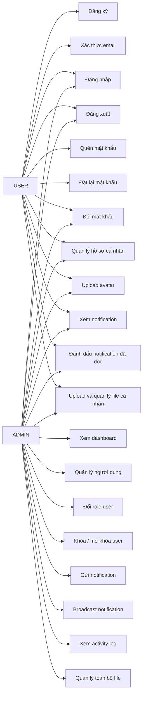

# BÁO CÁO PHÂN TÍCH THIẾT KẾ HỆ THỐNG

**ĐỀ TÀI:**

# XÂY DỰNG HỆ THỐNG LÕI XÁC THỰC, QUẢN LÝ NGƯỜI DÙNG VÀ QUẢN TRỊ HỆ THỐNG FULL-STACK

---

**TRƯỜNG:** ....................................................

**KHOA:** ......................................................

**Sinh viên thực hiện:** ..........................................

**Mã sinh viên:** ...............................................

**Lớp:** .......................................................

**Giảng viên hướng dẫn:** .......................................

**Năm học:** 2025 - 2026

---

# MỤC LỤC

1. Giới thiệu đề tài
2. Lý do chọn đề tài
3. Mục tiêu hệ thống
4. Phạm vi hệ thống
5. Công nghệ sử dụng
6. Phân tích yêu cầu hệ thống
   6.1. Yêu cầu chức năng
   6.2. Yêu cầu phi chức năng
7. Phân quyền người dùng
8. Sơ đồ Use Case
9. Đặc tả Use Case
10. Thiết kế cơ sở dữ liệu
11. Thiết kế API
12. Thiết kế giao diện
13. Bảo mật hệ thống
14. Kiểm thử hệ thống
15. Hướng phát triển
16. Kết luận

---

# 1. GIỚI THIỆU ĐỀ TÀI

Trong quá trình phát triển các hệ thống phần mềm hiện đại, các chức năng như xác thực người dùng, quản lý tài khoản, phân quyền, upload file, gửi email, thông báo trong hệ thống, ghi log hoạt động và dashboard quản trị là những thành phần nền tảng xuất hiện trong hầu hết các ứng dụng thực tế.

Đề tài "Xây dựng hệ thống lõi xác thực, quản lý người dùng và quản trị hệ thống Full-stack" được thực hiện nhằm xây dựng một bộ khung hệ thống hoàn chỉnh bao gồm cả Backend và Frontend. Hệ thống này không tập trung vào một nghiệp vụ cụ thể như bán hàng, đặt lịch hay học trực tuyến, mà tập trung xây dựng các module nền tảng có thể tái sử dụng trong nhiều loại đồ án lớn khác nhau.

Hệ thống được xây dựng với Backend sử dụng Node.js, Express.js, Prisma ORM, SQL Database, JWT, OAuth, Nodemailer và Multer. Phía Frontend sử dụng React, Vite, Tailwind CSS, React Router và Axios. Người dùng có thể đăng ký, xác thực email, đăng nhập, quản lý hồ sơ cá nhân, upload avatar, xem thông báo và đổi mật khẩu. Quản trị viên có thể quản lý người dùng, khóa/mở khóa tài khoản, gửi thông báo, xem nhật ký hoạt động và theo dõi thống kê hệ thống thông qua dashboard.

Đề tài giúp sinh viên rèn luyện khả năng phân tích, thiết kế và xây dựng một hệ thống Full-stack có tính ứng dụng cao, đồng thời tạo nền tảng để phát triển tiếp thành các hệ thống lớn hơn trong tương lai.

---

# 2. LÝ DO CHỌN ĐỀ TÀI

Hiện nay, hầu hết các hệ thống phần mềm đều cần có các chức năng nền tảng như đăng ký, đăng nhập, phân quyền người dùng, quản lý tài khoản, gửi email xác thực, quên mật khẩu, upload file và quản trị hệ thống. Nếu mỗi lần xây dựng một đồ án mới đều phải làm lại toàn bộ các chức năng này từ đầu thì sẽ mất nhiều thời gian và dễ phát sinh lỗi.

Vì vậy, việc xây dựng một hệ thống lõi có thể tái sử dụng là rất cần thiết. Hệ thống này có thể đóng vai trò là nền tảng ban đầu cho nhiều đồ án lớn như hệ thống bán hàng, hệ thống đặt lịch khám, hệ thống học trực tuyến, hệ thống quản lý sinh viên hoặc hệ thống quản lý công việc.

Bên cạnh đó, đề tài còn giúp người thực hiện hiểu rõ hơn về các vấn đề quan trọng trong phát triển phần mềm thực tế như bảo mật tài khoản, xác thực bằng JWT, OAuth, quản lý refresh token, phân quyền người dùng, gửi email tự động, upload file, ghi log hoạt động và xây dựng giao diện quản trị.

Việc chọn đề tài này giúp sinh viên không chỉ hoàn thành một hệ thống có thể chạy được, mà còn có được một bộ khung kỹ thuật vững chắc để tiếp tục mở rộng thành các sản phẩm phần mềm hoàn chỉnh hơn trong tương lai.

---

# 3. MỤC TIÊU HỆ THỐNG

Mục tiêu của hệ thống là xây dựng một nền tảng Full-stack hoàn chỉnh phục vụ cho việc xác thực, quản lý người dùng và quản trị hệ thống.

Các mục tiêu cụ thể bao gồm:

- Xây dựng chức năng đăng ký, đăng nhập và đăng xuất người dùng.
- Sử dụng JWT để xác thực và bảo vệ các API.
- Xây dựng cơ chế refresh token để duy trì phiên đăng nhập.
- Hỗ trợ đăng nhập bằng Google và Facebook thông qua OAuth.
- Xây dựng chức năng xác thực email sau khi đăng ký.
- Xây dựng chức năng quên mật khẩu và đặt lại mật khẩu qua email.
- Xây dựng chức năng quản lý hồ sơ cá nhân.
- Hỗ trợ upload, cập nhật và xóa avatar người dùng.
- Xây dựng module upload file dùng chung cho hệ thống.
- Xây dựng hệ thống email template để gửi email tự động.
- Xây dựng hệ thống thông báo trong ứng dụng.
- Xây dựng module ghi log hoạt động người dùng và quản trị viên.
- Xây dựng dashboard thống kê dành cho quản trị viên.
- Xây dựng giao diện Frontend thân thiện, dễ sử dụng.
- Phân quyền rõ ràng giữa người dùng thường và quản trị viên.
- Tạo nền tảng có thể mở rộng thành các đồ án lớn khác.

---

# 4. PHẠM VI HỆ THỐNG

Hệ thống tập trung xây dựng các chức năng lõi phục vụ cho việc quản lý người dùng và quản trị hệ thống. Phạm vi của đề tài bao gồm các chức năng chính sau:

### Đối với người dùng thường

Người dùng thường có thể:

- Đăng ký tài khoản.
- Xác thực email.
- Đăng nhập vào hệ thống.
- Đăng xuất khỏi hệ thống.
- Xem thông tin tài khoản cá nhân.
- Cập nhật thông tin cá nhân.
- Upload và xóa avatar.
- Đổi mật khẩu.
- Sử dụng chức năng quên mật khẩu.
- Xem danh sách thông báo.
- Đánh dấu thông báo đã đọc.
- Upload và quản lý file của chính mình.

### Đối với quản trị viên

Quản trị viên có thể:

- Đăng nhập vào hệ thống quản trị.
- Xem dashboard thống kê tổng quan.
- Xem danh sách người dùng.
- Tìm kiếm, lọc và phân trang danh sách người dùng.
- Đổi role người dùng.
- Khóa hoặc mở khóa tài khoản người dùng.
- Quản lý file upload của toàn bộ hệ thống.
- Gửi thông báo cho một người dùng.
- Gửi thông báo hàng loạt.
- Xem danh sách activity log.
- Tìm kiếm, lọc và xem chi tiết activity log.
- Theo dõi các hoạt động quan trọng của hệ thống.

### Ngoài phạm vi hiện tại

Đề tài hiện tại chưa tập trung vào một nghiệp vụ cụ thể như bán hàng, đặt lịch khám hay học trực tuyến. Các chức năng như quản lý sản phẩm, giỏ hàng, đơn hàng, thanh toán, lịch hẹn, khóa học hoặc bài kiểm tra sẽ được xem là hướng phát triển tiếp theo khi lựa chọn đề tài lớn cụ thể.

Hệ thống hiện tại đóng vai trò là nền tảng lõi để có thể tích hợp thêm các module nghiệp vụ trong tương lai.

---

# 5. CÔNG NGHỆ SỬ DỤNG

Hệ thống được xây dựng theo mô hình Full-stack, bao gồm Backend, Frontend và cơ sở dữ liệu. Các công nghệ được lựa chọn nhằm đảm bảo hệ thống dễ phát triển, dễ mở rộng và phù hợp với các đồ án phần mềm hiện đại.

## 5.1. Công nghệ Backend

### Node.js

Node.js được sử dụng để xây dựng phía Backend của hệ thống. Đây là môi trường chạy JavaScript phía server, phù hợp để xây dựng các API xử lý đăng nhập, đăng ký, quản lý người dùng, upload file, gửi email và thống kê hệ thống.

### Express.js

Express.js là framework web được sử dụng để xây dựng RESTful API. Express giúp tổ chức route, controller và middleware rõ ràng, từ đó làm cho Backend dễ bảo trì và mở rộng.

### Prisma ORM

Prisma được sử dụng để kết nối và thao tác với cơ sở dữ liệu SQL. Prisma giúp định nghĩa model dữ liệu, migration database và truy vấn dữ liệu một cách rõ ràng, an toàn hơn so với viết SQL thủ công.

### SQL Database

Hệ thống sử dụng cơ sở dữ liệu SQL để lưu trữ dữ liệu như người dùng, refresh token, file upload, notification và activity log. Việc sử dụng cơ sở dữ liệu quan hệ giúp đảm bảo tính toàn vẹn dữ liệu và dễ dàng thiết kế quan hệ giữa các bảng.

### JWT

JWT được sử dụng để xác thực người dùng. Sau khi đăng nhập thành công, hệ thống cấp access token cho người dùng để gọi các API cần đăng nhập.

### Bcrypt

Bcrypt được sử dụng để mã hóa mật khẩu trước khi lưu vào cơ sở dữ liệu. Nhờ đó, mật khẩu thật của người dùng không bị lưu trực tiếp trong database.

### Nodemailer

Nodemailer được sử dụng để gửi email tự động. Hệ thống dùng Nodemailer cho các chức năng như gửi email xác thực tài khoản, gửi link reset password, gửi email cảnh báo bảo mật và gửi email thông báo khóa/mở khóa tài khoản.

### Multer

Multer được sử dụng để xử lý upload file. Hệ thống dùng Multer cho chức năng upload avatar và upload file thông thường.

### OAuth Google/Facebook

OAuth được tích hợp để hỗ trợ đăng nhập bằng Google và Facebook. Đây là hình thức đăng nhập phổ biến, giúp người dùng có thêm lựa chọn ngoài đăng nhập bằng email và mật khẩu.

## 5.2. Công nghệ Frontend

### React

React được sử dụng để xây dựng giao diện người dùng. React giúp chia giao diện thành các component nhỏ, dễ quản lý và tái sử dụng.

### Vite

Vite được sử dụng để tạo và chạy project React. Vite có tốc độ khởi động nhanh, phù hợp trong quá trình phát triển Frontend.

### Tailwind CSS

Tailwind CSS được sử dụng để xây dựng giao diện nhanh, hiện đại và dễ tùy chỉnh. Các class tiện ích của Tailwind giúp tạo giao diện nhất quán mà không cần viết quá nhiều CSS riêng.

### React Router DOM

React Router DOM được sử dụng để quản lý điều hướng giữa các trang như login, register, profile, notifications, admin dashboard, admin users và admin activity logs.

### Axios

Axios được sử dụng để gọi API từ Frontend đến Backend. Hệ thống có cấu hình Axios Client để tự động gắn access token vào header Authorization.

### Lucide React

Lucide React được sử dụng để hiển thị icon trong giao diện, giúp hệ thống trực quan và thân thiện hơn.

### Recharts

Recharts được chuẩn bị để hiển thị biểu đồ thống kê trong dashboard quản trị nếu hệ thống tiếp tục mở rộng giao diện thống kê nâng cao.

## 5.3. Công cụ hỗ trợ phát triển

Các công cụ hỗ trợ trong quá trình phát triển hệ thống bao gồm:

- **Visual Studio Code**: dùng để viết code.
- **Git và GitHub**: dùng để quản lý mã nguồn.
- **Postman**: dùng để kiểm thử API.
- **Prisma Studio**: dùng để xem và kiểm tra dữ liệu trong database.
- **Browser DevTools**: dùng để kiểm tra giao diện, localStorage và request từ Frontend.

---

# 6. PHÂN TÍCH YÊU CẦU HỆ THỐNG

Chương này trình bày các yêu cầu chính của hệ thống, bao gồm yêu cầu chức năng và yêu cầu phi chức năng. Các yêu cầu được phân tích dựa trên hai nhóm người dùng chính là người dùng thường và quản trị viên.

## 6.1. Yêu cầu chức năng

Yêu cầu chức năng mô tả những chức năng cụ thể mà hệ thống cần cung cấp cho người dùng.

### 6.1.1. Chức năng xác thực người dùng

Hệ thống cần cung cấp các chức năng xác thực cơ bản và nâng cao, bao gồm:

- Đăng ký tài khoản bằng email và mật khẩu.
- Gửi email xác thực sau khi đăng ký.
- Xác thực email bằng token.
- Gửi lại email xác thực nếu người dùng chưa nhận được email.
- Đăng nhập bằng email và mật khẩu.
- Đăng nhập bằng Google.
- Đăng nhập bằng Facebook.
- Cấp access token và refresh token sau khi đăng nhập.
- Làm mới access token bằng refresh token.
- Đăng xuất khỏi hệ thống.
- Đổi mật khẩu khi người dùng đã đăng nhập.
- Gửi email quên mật khẩu.
- Đặt lại mật khẩu bằng token gửi qua email.
- Chặn đăng nhập đối với tài khoản chưa xác thực email.
- Chặn đăng nhập đối với tài khoản bị khóa.

### 6.1.2. Chức năng quản lý hồ sơ cá nhân

Người dùng sau khi đăng nhập có thể quản lý thông tin cá nhân của mình. Hệ thống cần cung cấp các chức năng:

- Xem thông tin hồ sơ cá nhân.
- Cập nhật họ tên.
- Cập nhật số điện thoại.
- Cập nhật địa chỉ.
- Upload avatar.
- Xóa avatar.
- Xem trạng thái tài khoản.
- Xem thông tin role, provider và thời gian đăng nhập gần nhất.

### 6.1.3. Chức năng quản lý người dùng dành cho admin

Quản trị viên có quyền quản lý danh sách người dùng trong hệ thống. Các chức năng bao gồm:

- Xem danh sách người dùng.
- Tìm kiếm người dùng theo tên, email hoặc số điện thoại.
- Lọc người dùng theo role.
- Lọc người dùng theo trạng thái tài khoản.
- Lọc người dùng theo provider.
- Phân trang danh sách người dùng.
- Xem chi tiết thông tin người dùng.
- Đổi role người dùng.
- Khóa tài khoản người dùng.
- Mở khóa tài khoản người dùng.

### 6.1.4. Chức năng upload file

Hệ thống cần hỗ trợ upload và quản lý file. Các chức năng bao gồm:

- Upload một file.
- Upload nhiều file.
- Upload avatar người dùng.
- Lưu thông tin file vào database.
- Phân loại file theo type.
- Lưu file theo folder.
- Xem danh sách file.
- Tìm kiếm file.
- Lọc file.
- Xem chi tiết file.
- Xóa file.
- Người dùng thường chỉ quản lý file của chính mình.
- Admin có thể quản lý toàn bộ file.

### 6.1.5. Chức năng email

Hệ thống cần gửi email tự động trong các trường hợp quan trọng:

- Gửi email test dành cho admin.
- Gửi email xác thực tài khoản.
- Gửi lại email xác thực.
- Gửi email đặt lại mật khẩu.
- Gửi email cảnh báo khi đổi mật khẩu.
- Gửi email cảnh báo khi reset mật khẩu.
- Gửi email thông báo khi tài khoản bị khóa.
- Gửi email thông báo khi tài khoản được mở khóa.

### 6.1.6. Chức năng notification

Hệ thống cần cung cấp thông báo trong ứng dụng cho người dùng. Các chức năng bao gồm:

- User xem danh sách thông báo.
- User xem số lượng thông báo chưa đọc.
- User lọc thông báo theo trạng thái đã đọc hoặc chưa đọc.
- User lọc thông báo theo loại thông báo.
- User đánh dấu một thông báo là đã đọc.
- User đánh dấu tất cả thông báo là đã đọc.
- Admin gửi thông báo cho một người dùng.
- Admin gửi thông báo hàng loạt.
- Hệ thống tự tạo thông báo khi admin đổi role người dùng.
- Hệ thống tự tạo thông báo khi admin khóa hoặc mở khóa tài khoản.

### 6.1.7. Chức năng activity log

Hệ thống cần ghi lại các hành động quan trọng để phục vụ việc theo dõi và truy vết. Các chức năng bao gồm:

- Ghi log khi người dùng đăng nhập.
- Ghi log khi người dùng đăng xuất.
- Ghi log khi người dùng đổi mật khẩu.
- Ghi log khi người dùng reset mật khẩu.
- Ghi log khi người dùng upload file.
- Ghi log khi người dùng xóa file.
- Ghi log khi admin đổi role người dùng.
- Ghi log khi admin khóa hoặc mở khóa người dùng.
- Ghi log khi admin gửi notification.
- Admin xem danh sách activity log.
- Admin tìm kiếm activity log.
- Admin lọc activity log theo userId, action và method.
- Admin xem chi tiết activity log.

### 6.1.8. Chức năng dashboard quản trị

Admin cần có dashboard để theo dõi nhanh tình trạng hệ thống. Các chức năng bao gồm:

- Xem tổng số người dùng.
- Xem số người dùng mới trong ngày.
- Xem số tài khoản bị khóa.
- Xem số tài khoản đang hoạt động.
- Xem tổng số file upload.
- Xem tổng số notification.
- Xem tổng số activity log.
- Xem số lượt login trong ngày.
- Thống kê user theo role.
- Thống kê user theo provider.
- Thống kê user theo status.
- Thống kê user đã xác thực và chưa xác thực email.
- Thống kê file theo type.
- Thống kê file theo folder.
- Thống kê notification theo type.
- Thống kê activity log theo action và method.
- Xem các hoạt động gần đây của hệ thống.

## 6.2. Yêu cầu phi chức năng

Yêu cầu phi chức năng mô tả các tiêu chí về chất lượng, bảo mật, hiệu năng, khả năng mở rộng và trải nghiệm sử dụng của hệ thống.

### 6.2.1. Yêu cầu về bảo mật

Hệ thống cần đảm bảo các yêu cầu bảo mật sau:

- Mật khẩu người dùng phải được mã hóa trước khi lưu vào database.
- Các API riêng tư phải yêu cầu access token hợp lệ.
- Các API admin chỉ cho phép tài khoản có role ADMIN truy cập.
- Refresh token cần được lưu và có thể thu hồi.
- Tài khoản bị khóa không được phép đăng nhập.
- Tài khoản local chưa xác thực email không được phép đăng nhập.
- Reset password token không được trả trực tiếp trong response.
- Các hành động quan trọng cần được ghi activity log.
- Upload file cần kiểm tra loại file và kích thước file.
- Không lưu thông tin nhạy cảm trong code nguồn.

### 6.2.2. Yêu cầu về hiệu năng

Hệ thống cần đảm bảo tốc độ phản hồi ổn định cho các chức năng chính:

- API đăng nhập và đăng ký phản hồi nhanh.
- Danh sách user, notification và activity log cần có phân trang.
- Dashboard sử dụng các truy vấn thống kê hợp lý.
- Frontend hiển thị loading khi đang gọi API.
- Các API thống kê nên dùng Promise.all để giảm thời gian chờ.

### 6.2.3. Yêu cầu về khả năng mở rộng

Hệ thống được thiết kế theo hướng module hóa, giúp dễ mở rộng trong tương lai:

- Backend chia thành route, controller, service, middleware và config.
- Frontend chia thành pages, layouts, routes, api, context và utils.
- Các module như email, notification, upload file và activity log có thể tái sử dụng.
- Có thể bổ sung thêm các role mới như DOCTOR, PATIENT, TEACHER, STUDENT, STAFF.
- Có thể tích hợp thêm các module nghiệp vụ như Product, Order, Appointment, Course.

### 6.2.4. Yêu cầu về khả năng bảo trì

Hệ thống cần có cấu trúc rõ ràng để dễ bảo trì:

- Code được chia thành các module riêng biệt.
- Tên file, tên hàm và tên biến rõ nghĩa.
- API được tài liệu hóa trong README và API documentation.
- Các biến môi trường được tách riêng trong file .env.
- Các file .env.example giúp người khác cấu hình project dễ dàng.
- README tổng hướng dẫn cách chạy toàn bộ hệ thống.

### 6.2.5. Yêu cầu về giao diện người dùng

Frontend cần đảm bảo dễ sử dụng và thân thiện:

- Giao diện rõ ràng, dễ hiểu.
- Các form có thông báo lỗi và thông báo thành công.
- Có loading state khi đang xử lý.
- Có route bảo vệ cho trang yêu cầu đăng nhập.
- Có route riêng cho admin.
- Giao diện quản trị hiển thị thông tin thống kê dễ quan sát.
- Các bảng dữ liệu có tìm kiếm, lọc và phân trang.

### 6.2.6. Yêu cầu về tính tái sử dụng

Hệ thống cần có khả năng tái sử dụng cho nhiều đồ án lớn khác nhau:

- Module xác thực có thể dùng lại trong mọi hệ thống.
- Module user profile có thể dùng lại cho mọi loại tài khoản.
- Module upload file có thể dùng cho sản phẩm, avatar, tài liệu hoặc hình ảnh.
- Module email có thể dùng cho thông báo đơn hàng, lịch hẹn hoặc khóa học.
- Module notification có thể dùng cho nhiều nghiệp vụ khác nhau.
- Module activity log giúp hệ thống nào cũng có khả năng truy vết.
- Admin dashboard có thể mở rộng thêm các chỉ số theo từng đề tài cụ thể.

---

# 7. PHÂN QUYỀN NGƯỜI DÙNG

Hệ thống được thiết kế với hai nhóm người dùng chính là USER và ADMIN. Việc phân quyền giúp đảm bảo người dùng chỉ được truy cập các chức năng phù hợp với vai trò của mình.

## 7.1. Người dùng thường - USER

Người dùng thường là người sử dụng hệ thống sau khi đăng ký và đăng nhập thành công. USER có thể thực hiện các chức năng cá nhân, quản lý thông tin của chính mình và sử dụng các chức năng cơ bản của hệ thống.

Các quyền của USER bao gồm:

- Đăng ký tài khoản.
- Xác thực email.
- Đăng nhập vào hệ thống.
- Đăng xuất khỏi hệ thống.
- Xem thông tin cá nhân.
- Cập nhật thông tin cá nhân.
- Upload avatar.
- Xóa avatar.
- Đổi mật khẩu.
- Quên mật khẩu và đặt lại mật khẩu.
- Xem danh sách notification của chính mình.
- Đánh dấu notification đã đọc.
- Upload file cá nhân.
- Xem file do chính mình upload.
- Xóa file do chính mình upload.

USER không được phép truy cập các chức năng quản trị như quản lý người dùng, xem activity log toàn hệ thống hoặc xem admin dashboard.

## 7.2. Quản trị viên - ADMIN

ADMIN là người có quyền quản lý và giám sát hệ thống. Ngoài các quyền của USER, ADMIN có thêm các quyền quản trị.

Các quyền của ADMIN bao gồm:

- Xem danh sách tất cả người dùng.
- Tìm kiếm, lọc và phân trang danh sách người dùng.
- Xem chi tiết thông tin người dùng.
- Đổi role người dùng.
- Khóa hoặc mở khóa tài khoản người dùng.
- Xem toàn bộ file upload trong hệ thống.
- Xóa file của bất kỳ người dùng nào.
- Gửi notification cho một người dùng.
- Gửi notification hàng loạt.
- Xem danh sách activity log.
- Tìm kiếm, lọc và xem chi tiết activity log.
- Xem dashboard thống kê hệ thống.
- Gửi email test.
- Theo dõi tình trạng hoạt động của hệ thống.

## 7.3. Bảng phân quyền tổng quát

| Chức năng | USER | ADMIN |
|---|---|---:|---:|
| Đăng ký | Có | Có |
| Đăng nhập | Có | Có |
| Xác thực email | Có | Có |
| Quên mật khẩu | Có | Có |
| Đổi mật khẩu | Có | Có |
| Xem hồ sơ cá nhân | Có | Có |
| Cập nhật hồ sơ cá nhân | Có | Có |
| Upload avatar | Có | Có |
| Xem notification cá nhân | Có | Có |
| Upload file cá nhân | Có | Có |
| Quản lý file của chính mình | Có | Có |
| Xem danh sách tất cả user | Không | Có |
| Đổi role user | Không | Có |
| Khóa / mở khóa user | Không | Có |
| Gửi notification cho user | Không | Có |
| Broadcast notification | Không | Có |
| Xem activity log toàn hệ thống | Không | Có |
| Xem admin dashboard | Không | Có |

---

# 8. SƠ ĐỒ USE CASE

Sơ đồ Use Case mô tả các chức năng chính của hệ thống và mối quan hệ giữa tác nhân với hệ thống.

## 8.1. Các tác nhân chính

Hệ thống có hai tác nhân chính:

### USER

USER là người dùng thường của hệ thống. USER có thể đăng ký, đăng nhập, quản lý hồ sơ cá nhân, sử dụng chức năng quên mật khẩu, xem notification và upload file cá nhân.

### ADMIN

ADMIN là quản trị viên của hệ thống. ADMIN kế thừa các chức năng của USER và có thêm các chức năng quản trị như quản lý người dùng, xem dashboard, gửi notification và xem activity log.

## 8.2. Danh sách Use Case chính

### Nhóm Use Case của USER

- Đăng ký tài khoản.
- Xác thực email.
- Đăng nhập.
- Đăng xuất.
- Quên mật khẩu.
- Đặt lại mật khẩu.
- Đổi mật khẩu.
- Xem hồ sơ cá nhân.
- Cập nhật hồ sơ cá nhân.
- Upload avatar.
- Xóa avatar.
- Xem notification.
- Đánh dấu notification đã đọc.
- Upload file.
- Xem file cá nhân.
- Xóa file cá nhân.

### Nhóm Use Case của ADMIN

- Xem dashboard.
- Xem danh sách người dùng.
- Tìm kiếm và lọc người dùng.
- Xem chi tiết người dùng.
- Đổi role người dùng.
- Khóa / mở khóa người dùng.
- Gửi notification cho một user.
- Broadcast notification.
- Xem activity log.
- Tìm kiếm và lọc activity log.
- Xem chi tiết activity log.
- Xem toàn bộ file upload.
- Xóa file của user.

## 8.3. Sơ đồ Use Case tổng quát

---

# 9. ĐẶC TẢ USE CASE

Phần này mô tả chi tiết một số Use Case quan trọng trong hệ thống. Mỗi Use Case bao gồm tác nhân, điều kiện trước, luồng xử lý chính và kết quả sau khi thực hiện.

## 9.1. Use Case: Đăng ký tài khoản

| Thành phần | Nội dung |
|---|---|
| Tên Use Case | Đăng ký tài khoản |
| Tác nhân | USER |
| Mục tiêu | Cho phép người dùng tạo tài khoản mới |
| Điều kiện trước | Người dùng chưa có tài khoản trong hệ thống |
| Điều kiện sau | Tài khoản được tạo và email xác thực được gửi |

### Luồng xử lý chính

1. Người dùng mở trang đăng ký.
2. Người dùng nhập họ tên, email và mật khẩu.
3. Frontend kiểm tra dữ liệu nhập.
4. Frontend gửi request đăng ký đến Backend.
5. Backend kiểm tra email đã tồn tại hay chưa.
6. Backend mã hóa mật khẩu bằng bcrypt.
7. Backend tạo tài khoản mới với trạng thái chưa xác thực email.
8. Backend tạo token xác thực email.
9. Backend gửi email xác thực cho người dùng.
10. Frontend hiển thị thông báo đăng ký thành công.

### Luồng ngoại lệ

- Nếu email đã tồn tại, hệ thống trả về thông báo lỗi.
- Nếu dữ liệu nhập không hợp lệ, hệ thống yêu cầu nhập lại.
- Nếu gửi email thất bại, hệ thống trả về lỗi tương ứng.

## 9.2. Use Case: Đăng nhập

| Thành phần | Nội dung |
|---|---|
| Tên Use Case | Đăng nhập |
| Tác nhân | USER, ADMIN |
| Mục tiêu | Cho phép người dùng truy cập hệ thống |
| Điều kiện trước | Người dùng đã có tài khoản hợp lệ |
| Điều kiện sau | Người dùng nhận được access token và refresh token |

### Luồng xử lý chính

1. Người dùng mở trang đăng nhập.
2. Người dùng nhập email và mật khẩu.
3. Frontend gửi request đăng nhập đến Backend.
4. Backend kiểm tra email có tồn tại hay không.
5. Backend kiểm tra mật khẩu bằng bcrypt.
6. Backend kiểm tra tài khoản có bị khóa hay không.
7. Backend kiểm tra tài khoản local đã xác thực email hay chưa.
8. Backend tạo access token và refresh token.
9. Backend lưu refresh token vào database.
10. Backend trả token và thông tin user về Frontend.
11. Frontend lưu token vào localStorage.
12. Nếu user là ADMIN thì chuyển đến trang admin dashboard.
13. Nếu user là USER thì chuyển đến trang profile.

### Luồng ngoại lệ

- Nếu email hoặc mật khẩu sai, hệ thống trả về lỗi.
- Nếu tài khoản chưa xác thực email, hệ thống yêu cầu xác thực.
- Nếu tài khoản bị khóa, hệ thống không cho đăng nhập.

## 9.3. Use Case: Quên mật khẩu và đặt lại mật khẩu

| Thành phần | Nội dung |
|---|---|
| Tên Use Case | Quên mật khẩu và đặt lại mật khẩu |
| Tác nhân | USER, ADMIN |
| Mục tiêu | Cho phép người dùng đặt lại mật khẩu khi quên |
| Điều kiện trước | Người dùng có tài khoản local trong hệ thống |
| Điều kiện sau | Mật khẩu mới được cập nhật |

### Luồng xử lý chính

1. Người dùng mở trang quên mật khẩu.
2. Người dùng nhập email.
3. Frontend gửi request quên mật khẩu đến Backend.
4. Backend kiểm tra tài khoản.
5. Backend tạo reset password token.
6. Backend lưu token và thời hạn vào database.
7. Backend gửi link reset password qua email.
8. Người dùng bấm link trong email.
9. Frontend mở trang reset password kèm token.
10. Người dùng nhập mật khẩu mới.
11. Frontend gửi request reset password đến Backend.
12. Backend kiểm tra token hợp lệ và còn hạn.
13. Backend mã hóa mật khẩu mới.
14. Backend cập nhật mật khẩu.
15. Backend xóa reset password token.
16. Backend thu hồi refresh token cũ.
17. Backend gửi email cảnh báo bảo mật.
18. Người dùng đăng nhập lại bằng mật khẩu mới.

### Luồng ngoại lệ

- Nếu email không tồn tại, hệ thống không tiết lộ trực tiếp để tăng bảo mật.
- Nếu token sai hoặc hết hạn, hệ thống báo lỗi.
- Nếu tài khoản đăng nhập bằng Google/Facebook, hệ thống không cho reset password bằng cách này.

## 9.4. Use Case: Khóa / mở khóa tài khoản người dùng

| Thành phần | Nội dung |
|---|---|
| Tên Use Case | Khóa / mở khóa tài khoản người dùng |
| Tác nhân | ADMIN |
| Mục tiêu | Cho phép admin kiểm soát trạng thái tài khoản |
| Điều kiện trước | Admin đã đăng nhập |
| Điều kiện sau | Trạng thái tài khoản user được cập nhật |

### Luồng xử lý chính

1. Admin mở trang quản lý người dùng.
2. Admin tìm user cần khóa hoặc mở khóa.
3. Admin bấm nút khóa hoặc mở khóa.
4. Frontend gửi request cập nhật trạng thái đến Backend.
5. Backend kiểm tra quyền ADMIN.
6. Backend kiểm tra admin không tự khóa chính mình.
7. Backend cập nhật status của user.
8. Nếu user bị khóa, Backend thu hồi refresh token của user.
9. Backend gửi email thông báo cho user.
10. Backend tạo notification trong hệ thống cho user.
11. Backend ghi activity log.
12. Frontend cập nhật lại danh sách user.

### Luồng ngoại lệ

- Nếu user không tồn tại, hệ thống trả về lỗi.
- Nếu admin tự khóa chính mình, hệ thống từ chối thao tác.
- Nếu user thường gọi API này, hệ thống từ chối quyền truy cập.

## 9.5. Use Case: Xem activity log

| Thành phần | Nội dung |
|---|---|
| Tên Use Case | Xem activity log |
| Tác nhân | ADMIN |
| Mục tiêu | Cho phép admin theo dõi các hoạt động quan trọng |
| Điều kiện trước | Admin đã đăng nhập |
| Điều kiện sau | Danh sách log hoặc chi tiết log được hiển thị |

### Luồng xử lý chính

1. Admin mở trang Activity Logs.
2. Frontend gọi API lấy danh sách activity log.
3. Backend kiểm tra quyền ADMIN.
4. Backend truy vấn danh sách log từ database.
5. Backend trả dữ liệu log kèm thông tin user.
6. Frontend hiển thị log dưới dạng bảng.
7. Admin có thể tìm kiếm theo action, details hoặc path.
8. Admin có thể lọc theo userId, action và method.
9. Admin có thể bấm xem chi tiết một log.
10. Frontend hiển thị modal chi tiết log.

### Luồng ngoại lệ

- Nếu user không phải ADMIN, hệ thống chuyển về trang profile hoặc trả lỗi không có quyền.
- Nếu log không tồn tại, hệ thống trả về thông báo không tìm thấy.

---

# 10. THIẾT KẾ CƠ SỞ DỮ LIỆU

*(Nội dung sẽ được điền sau)*

---

# 11. THIẾT KẾ API

*(Nội dung sẽ được điền sau)*

---

# 12. THIẾT KẾ GIAO DIỆN

*(Nội dung sẽ được điền sau)*

---

# 13. BẢO MẬT HỆ THỐNG

*(Nội dung sẽ được điền sau)*

---

# 14. KIỂM THỬ HỆ THỐNG

*(Nội dung sẽ được điền sau)*

---

# 15. HƯỚNG PHÁT TRIỂN

*(Nội dung sẽ được điền sau)*

---

# 16. KẾT LUẬN

*(Nội dung sẽ được điền sau)*
