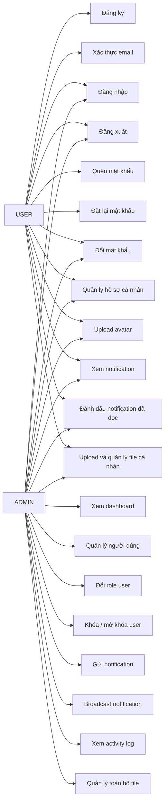
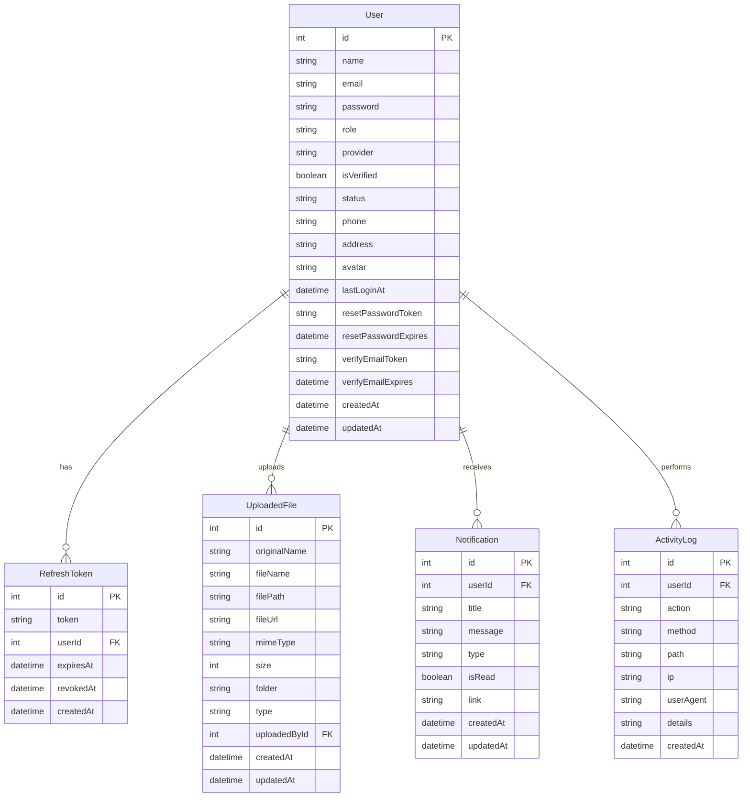

# BÁO CÁO PHÂN TÍCH THIẾT KẾ HỆ THỐNG

**ĐỀ TÀI:**

# XÂY DỰNG HỆ THỐNG LÕI XÁC THỰC, QUẢN LÝ NGƯỜI DÙNG VÀ QUẢN TRỊ HỆ THỐNG FULL-STACK

---

**TRƯỜNG:** ....................................................

**KHOA:** ......................................................

**Sinh viên thực hiện:** ..........................................

**Mã sinh viên:** ...............................................

**Lớp:** .......................................................

**Giảng viên hướng dẫn:** .......................................

**Năm học:** 2025 - 2026

---

# MỤC LỤC

1. Giới thiệu đề tài
2. Lý do chọn đề tài
3. Mục tiêu hệ thống
4. Phạm vi hệ thống
5. Công nghệ sử dụng
6. Phân tích yêu cầu hệ thống
   6.1. Yêu cầu chức năng
   6.2. Yêu cầu phi chức năng
7. Phân quyền người dùng
8. Sơ đồ Use Case
9. Đặc tả Use Case
10. Thiết kế cơ sở dữ liệu
11. Thiết kế API
12. Thiết kế giao diện
13. Bảo mật hệ thống
14. Kiểm thử hệ thống
15. Hướng phát triển
16. Kết luận

---

# 1. GIỚI THIỆU ĐỀ TÀI

Trong quá trình phát triển các hệ thống phần mềm hiện đại, các chức năng như xác thực người dùng, quản lý tài khoản, phân quyền, upload file, gửi email, thông báo trong hệ thống, ghi log hoạt động và dashboard quản trị là những thành phần nền tảng xuất hiện trong hầu hết các ứng dụng thực tế.

Đề tài "Xây dựng hệ thống lõi xác thực, quản lý người dùng và quản trị hệ thống Full-stack" được thực hiện nhằm xây dựng một bộ khung hệ thống hoàn chỉnh bao gồm cả Backend và Frontend. Hệ thống này không tập trung vào một nghiệp vụ cụ thể như bán hàng, đặt lịch hay học trực tuyến, mà tập trung xây dựng các module nền tảng có thể tái sử dụng trong nhiều loại đồ án lớn khác nhau.

Hệ thống được xây dựng với Backend sử dụng Node.js, Express.js, Prisma ORM, SQL Database, JWT, OAuth, Nodemailer và Multer. Phía Frontend sử dụng React, Vite, Tailwind CSS, React Router và Axios. Người dùng có thể đăng ký, xác thực email, đăng nhập, quản lý hồ sơ cá nhân, upload avatar, xem thông báo và đổi mật khẩu. Quản trị viên có thể quản lý người dùng, khóa/mở khóa tài khoản, gửi thông báo, xem nhật ký hoạt động và theo dõi thống kê hệ thống thông qua dashboard.

Đề tài giúp sinh viên rèn luyện khả năng phân tích, thiết kế và xây dựng một hệ thống Full-stack có tính ứng dụng cao, đồng thời tạo nền tảng để phát triển tiếp thành các hệ thống lớn hơn trong tương lai.

---

# 2. LÝ DO CHỌN ĐỀ TÀI

Hiện nay, hầu hết các hệ thống phần mềm đều cần có các chức năng nền tảng như đăng ký, đăng nhập, phân quyền người dùng, quản lý tài khoản, gửi email xác thực, quên mật khẩu, upload file và quản trị hệ thống. Nếu mỗi lần xây dựng một đồ án mới đều phải làm lại toàn bộ các chức năng này từ đầu thì sẽ mất nhiều thời gian và dễ phát sinh lỗi.

Vì vậy, việc xây dựng một hệ thống lõi có thể tái sử dụng là rất cần thiết. Hệ thống này có thể đóng vai trò là nền tảng ban đầu cho nhiều đồ án lớn như hệ thống bán hàng, hệ thống đặt lịch khám, hệ thống học trực tuyến, hệ thống quản lý sinh viên hoặc hệ thống quản lý công việc.

Bên cạnh đó, đề tài còn giúp người thực hiện hiểu rõ hơn về các vấn đề quan trọng trong phát triển phần mềm thực tế như bảo mật tài khoản, xác thực bằng JWT, OAuth, quản lý refresh token, phân quyền người dùng, gửi email tự động, upload file, ghi log hoạt động và xây dựng giao diện quản trị.

Việc chọn đề tài này giúp sinh viên không chỉ hoàn thành một hệ thống có thể chạy được, mà còn có được một bộ khung kỹ thuật vững chắc để tiếp tục mở rộng thành các sản phẩm phần mềm hoàn chỉnh hơn trong tương lai.

---

# 3. MỤC TIÊU HỆ THỐNG

Mục tiêu của hệ thống là xây dựng một nền tảng Full-stack hoàn chỉnh phục vụ cho việc xác thực, quản lý người dùng và quản trị hệ thống.

Các mục tiêu cụ thể bao gồm:

- Xây dựng chức năng đăng ký, đăng nhập và đăng xuất người dùng.
- Sử dụng JWT để xác thực và bảo vệ các API.
- Xây dựng cơ chế refresh token để duy trì phiên đăng nhập.
- Hỗ trợ đăng nhập bằng Google và Facebook thông qua OAuth.
- Xây dựng chức năng xác thực email sau khi đăng ký.
- Xây dựng chức năng quên mật khẩu và đặt lại mật khẩu qua email.
- Xây dựng chức năng quản lý hồ sơ cá nhân.
- Hỗ trợ upload, cập nhật và xóa avatar người dùng.
- Xây dựng module upload file dùng chung cho hệ thống.
- Xây dựng hệ thống email template để gửi email tự động.
- Xây dựng hệ thống thông báo trong ứng dụng.
- Xây dựng module ghi log hoạt động người dùng và quản trị viên.
- Xây dựng dashboard thống kê dành cho quản trị viên.
- Xây dựng giao diện Frontend thân thiện, dễ sử dụng.
- Phân quyền rõ ràng giữa người dùng thường và quản trị viên.
- Tạo nền tảng có thể mở rộng thành các đồ án lớn khác.

---

# 4. PHẠM VI HỆ THỐNG

Hệ thống tập trung xây dựng các chức năng lõi phục vụ cho việc quản lý người dùng và quản trị hệ thống. Phạm vi của đề tài bao gồm các chức năng chính sau:

### Đối với người dùng thường

Người dùng thường có thể:

- Đăng ký tài khoản.
- Xác thực email.
- Đăng nhập vào hệ thống.
- Đăng xuất khỏi hệ thống.
- Xem thông tin tài khoản cá nhân.
- Cập nhật thông tin cá nhân.
- Upload và xóa avatar.
- Đổi mật khẩu.
- Sử dụng chức năng quên mật khẩu.
- Xem danh sách thông báo.
- Đánh dấu thông báo đã đọc.
- Upload và quản lý file của chính mình.

### Đối với quản trị viên

Quản trị viên có thể:

- Đăng nhập vào hệ thống quản trị.
- Xem dashboard thống kê tổng quan.
- Xem danh sách người dùng.
- Tìm kiếm, lọc và phân trang danh sách người dùng.
- Đổi role người dùng.
- Khóa hoặc mở khóa tài khoản người dùng.
- Quản lý file upload của toàn bộ hệ thống.
- Gửi thông báo cho một người dùng.
- Gửi thông báo hàng loạt.
- Xem danh sách activity log.
- Tìm kiếm, lọc và xem chi tiết activity log.
- Theo dõi các hoạt động quan trọng của hệ thống.

### Ngoài phạm vi hiện tại

Đề tài hiện tại chưa tập trung vào một nghiệp vụ cụ thể như bán hàng, đặt lịch khám hay học trực tuyến. Các chức năng như quản lý sản phẩm, giỏ hàng, đơn hàng, thanh toán, lịch hẹn, khóa học hoặc bài kiểm tra sẽ được xem là hướng phát triển tiếp theo khi lựa chọn đề tài lớn cụ thể.

Hệ thống hiện tại đóng vai trò là nền tảng lõi để có thể tích hợp thêm các module nghiệp vụ trong tương lai.

---

# 5. CÔNG NGHỆ SỬ DỤNG

Hệ thống được xây dựng theo mô hình Full-stack, bao gồm Backend, Frontend và cơ sở dữ liệu. Các công nghệ được lựa chọn nhằm đảm bảo hệ thống dễ phát triển, dễ mở rộng và phù hợp với các đồ án phần mềm hiện đại.

## 5.1. Công nghệ Backend

### Node.js

Node.js được sử dụng để xây dựng phía Backend của hệ thống. Đây là môi trường chạy JavaScript phía server, phù hợp để xây dựng các API xử lý đăng nhập, đăng ký, quản lý người dùng, upload file, gửi email và thống kê hệ thống.

### Express.js

Express.js là framework web được sử dụng để xây dựng RESTful API. Express giúp tổ chức route, controller và middleware rõ ràng, từ đó làm cho Backend dễ bảo trì và mở rộng.

### Prisma ORM

Prisma được sử dụng để kết nối và thao tác với cơ sở dữ liệu SQL. Prisma giúp định nghĩa model dữ liệu, migration database và truy vấn dữ liệu một cách rõ ràng, an toàn hơn so với viết SQL thủ công.

### SQL Database

Hệ thống sử dụng cơ sở dữ liệu SQL để lưu trữ dữ liệu như người dùng, refresh token, file upload, notification và activity log. Việc sử dụng cơ sở dữ liệu quan hệ giúp đảm bảo tính toàn vẹn dữ liệu và dễ dàng thiết kế quan hệ giữa các bảng.

### JWT

JWT được sử dụng để xác thực người dùng. Sau khi đăng nhập thành công, hệ thống cấp access token cho người dùng để gọi các API cần đăng nhập.

### Bcrypt

Bcrypt được sử dụng để mã hóa mật khẩu trước khi lưu vào cơ sở dữ liệu. Nhờ đó, mật khẩu thật của người dùng không bị lưu trực tiếp trong database.

### Nodemailer

Nodemailer được sử dụng để gửi email tự động. Hệ thống dùng Nodemailer cho các chức năng như gửi email xác thực tài khoản, gửi link reset password, gửi email cảnh báo bảo mật và gửi email thông báo khóa/mở khóa tài khoản.

### Multer

Multer được sử dụng để xử lý upload file. Hệ thống dùng Multer cho chức năng upload avatar và upload file thông thường.

### OAuth Google/Facebook

OAuth được tích hợp để hỗ trợ đăng nhập bằng Google và Facebook. Đây là hình thức đăng nhập phổ biến, giúp người dùng có thêm lựa chọn ngoài đăng nhập bằng email và mật khẩu.

## 5.2. Công nghệ Frontend

### React

React được sử dụng để xây dựng giao diện người dùng. React giúp chia giao diện thành các component nhỏ, dễ quản lý và tái sử dụng.

### Vite

Vite được sử dụng để tạo và chạy project React. Vite có tốc độ khởi động nhanh, phù hợp trong quá trình phát triển Frontend.

### Tailwind CSS

Tailwind CSS được sử dụng để xây dựng giao diện nhanh, hiện đại và dễ tùy chỉnh. Các class tiện ích của Tailwind giúp tạo giao diện nhất quán mà không cần viết quá nhiều CSS riêng.

### React Router DOM

React Router DOM được sử dụng để quản lý điều hướng giữa các trang như login, register, profile, notifications, admin dashboard, admin users và admin activity logs.

### Axios

Axios được sử dụng để gọi API từ Frontend đến Backend. Hệ thống có cấu hình Axios Client để tự động gắn access token vào header Authorization.

### Lucide React

Lucide React được sử dụng để hiển thị icon trong giao diện, giúp hệ thống trực quan và thân thiện hơn.

### Recharts

Recharts được chuẩn bị để hiển thị biểu đồ thống kê trong dashboard quản trị nếu hệ thống tiếp tục mở rộng giao diện thống kê nâng cao.

## 5.3. Công cụ hỗ trợ phát triển

Các công cụ hỗ trợ trong quá trình phát triển hệ thống bao gồm:

- **Visual Studio Code**: dùng để viết code.
- **Git và GitHub**: dùng để quản lý mã nguồn.
- **Postman**: dùng để kiểm thử API.
- **Prisma Studio**: dùng để xem và kiểm tra dữ liệu trong database.
- **Browser DevTools**: dùng để kiểm tra giao diện, localStorage và request từ Frontend.

---

# 6. PHÂN TÍCH YÊU CẦU HỆ THỐNG

Chương này trình bày các yêu cầu chính của hệ thống, bao gồm yêu cầu chức năng và yêu cầu phi chức năng. Các yêu cầu được phân tích dựa trên hai nhóm người dùng chính là người dùng thường và quản trị viên.

## 6.1. Yêu cầu chức năng

Yêu cầu chức năng mô tả những chức năng cụ thể mà hệ thống cần cung cấp cho người dùng.

### 6.1.1. Chức năng xác thực người dùng

Hệ thống cần cung cấp các chức năng xác thực cơ bản và nâng cao, bao gồm:

- Đăng ký tài khoản bằng email và mật khẩu.
- Gửi email xác thực sau khi đăng ký.
- Xác thực email bằng token.
- Gửi lại email xác thực nếu người dùng chưa nhận được email.
- Đăng nhập bằng email và mật khẩu.
- Đăng nhập bằng Google.
- Đăng nhập bằng Facebook.
- Cấp access token và refresh token sau khi đăng nhập.
- Làm mới access token bằng refresh token.
- Đăng xuất khỏi hệ thống.
- Đổi mật khẩu khi người dùng đã đăng nhập.
- Gửi email quên mật khẩu.
- Đặt lại mật khẩu bằng token gửi qua email.
- Chặn đăng nhập đối với tài khoản chưa xác thực email.
- Chặn đăng nhập đối với tài khoản bị khóa.

### 6.1.2. Chức năng quản lý hồ sơ cá nhân

Người dùng sau khi đăng nhập có thể quản lý thông tin cá nhân của mình. Hệ thống cần cung cấp các chức năng:

- Xem thông tin hồ sơ cá nhân.
- Cập nhật họ tên.
- Cập nhật số điện thoại.
- Cập nhật địa chỉ.
- Upload avatar.
- Xóa avatar.
- Xem trạng thái tài khoản.
- Xem thông tin role, provider và thời gian đăng nhập gần nhất.

### 6.1.3. Chức năng quản lý người dùng dành cho admin

Quản trị viên có quyền quản lý danh sách người dùng trong hệ thống. Các chức năng bao gồm:

- Xem danh sách người dùng.
- Tìm kiếm người dùng theo tên, email hoặc số điện thoại.
- Lọc người dùng theo role.
- Lọc người dùng theo trạng thái tài khoản.
- Lọc người dùng theo provider.
- Phân trang danh sách người dùng.
- Xem chi tiết thông tin người dùng.
- Đổi role người dùng.
- Khóa tài khoản người dùng.
- Mở khóa tài khoản người dùng.

### 6.1.4. Chức năng upload file

Hệ thống cần hỗ trợ upload và quản lý file. Các chức năng bao gồm:

- Upload một file.
- Upload nhiều file.
- Upload avatar người dùng.
- Lưu thông tin file vào database.
- Phân loại file theo type.
- Lưu file theo folder.
- Xem danh sách file.
- Tìm kiếm file.
- Lọc file.
- Xem chi tiết file.
- Xóa file.
- Người dùng thường chỉ quản lý file của chính mình.
- Admin có thể quản lý toàn bộ file.

### 6.1.5. Chức năng email

Hệ thống cần gửi email tự động trong các trường hợp quan trọng:

- Gửi email test dành cho admin.
- Gửi email xác thực tài khoản.
- Gửi lại email xác thực.
- Gửi email đặt lại mật khẩu.
- Gửi email cảnh báo khi đổi mật khẩu.
- Gửi email cảnh báo khi reset mật khẩu.
- Gửi email thông báo khi tài khoản bị khóa.
- Gửi email thông báo khi tài khoản được mở khóa.

### 6.1.6. Chức năng notification

Hệ thống cần cung cấp thông báo trong ứng dụng cho người dùng. Các chức năng bao gồm:

- User xem danh sách thông báo.
- User xem số lượng thông báo chưa đọc.
- User lọc thông báo theo trạng thái đã đọc hoặc chưa đọc.
- User lọc thông báo theo loại thông báo.
- User đánh dấu một thông báo là đã đọc.
- User đánh dấu tất cả thông báo là đã đọc.
- Admin gửi thông báo cho một người dùng.
- Admin gửi thông báo hàng loạt.
- Hệ thống tự tạo thông báo khi admin đổi role người dùng.
- Hệ thống tự tạo thông báo khi admin khóa hoặc mở khóa tài khoản.

### 6.1.7. Chức năng activity log

Hệ thống cần ghi lại các hành động quan trọng để phục vụ việc theo dõi và truy vết. Các chức năng bao gồm:

- Ghi log khi người dùng đăng nhập.
- Ghi log khi người dùng đăng xuất.
- Ghi log khi người dùng đổi mật khẩu.
- Ghi log khi người dùng reset mật khẩu.
- Ghi log khi người dùng upload file.
- Ghi log khi người dùng xóa file.
- Ghi log khi admin đổi role người dùng.
- Ghi log khi admin khóa hoặc mở khóa người dùng.
- Ghi log khi admin gửi notification.
- Admin xem danh sách activity log.
- Admin tìm kiếm activity log.
- Admin lọc activity log theo userId, action và method.
- Admin xem chi tiết activity log.

### 6.1.8. Chức năng dashboard quản trị

Admin cần có dashboard để theo dõi nhanh tình trạng hệ thống. Các chức năng bao gồm:

- Xem tổng số người dùng.
- Xem số người dùng mới trong ngày.
- Xem số tài khoản bị khóa.
- Xem số tài khoản đang hoạt động.
- Xem tổng số file upload.
- Xem tổng số notification.
- Xem tổng số activity log.
- Xem số lượt login trong ngày.
- Thống kê user theo role.
- Thống kê user theo provider.
- Thống kê user theo status.
- Thống kê user đã xác thực và chưa xác thực email.
- Thống kê file theo type.
- Thống kê file theo folder.
- Thống kê notification theo type.
- Thống kê activity log theo action và method.
- Xem các hoạt động gần đây của hệ thống.

## 6.2. Yêu cầu phi chức năng

Yêu cầu phi chức năng mô tả các tiêu chí về chất lượng, bảo mật, hiệu năng, khả năng mở rộng và trải nghiệm sử dụng của hệ thống.

### 6.2.1. Yêu cầu về bảo mật

Hệ thống cần đảm bảo các yêu cầu bảo mật sau:

- Mật khẩu người dùng phải được mã hóa trước khi lưu vào database.
- Các API riêng tư phải yêu cầu access token hợp lệ.
- Các API admin chỉ cho phép tài khoản có role ADMIN truy cập.
- Refresh token cần được lưu và có thể thu hồi.
- Tài khoản bị khóa không được phép đăng nhập.
- Tài khoản local chưa xác thực email không được phép đăng nhập.
- Reset password token không được trả trực tiếp trong response.
- Các hành động quan trọng cần được ghi activity log.
- Upload file cần kiểm tra loại file và kích thước file.
- Không lưu thông tin nhạy cảm trong code nguồn.

### 6.2.2. Yêu cầu về hiệu năng

Hệ thống cần đảm bảo tốc độ phản hồi ổn định cho các chức năng chính:

- API đăng nhập và đăng ký phản hồi nhanh.
- Danh sách user, notification và activity log cần có phân trang.
- Dashboard sử dụng các truy vấn thống kê hợp lý.
- Frontend hiển thị loading khi đang gọi API.
- Các API thống kê nên dùng Promise.all để giảm thời gian chờ.

### 6.2.3. Yêu cầu về khả năng mở rộng

Hệ thống được thiết kế theo hướng module hóa, giúp dễ mở rộng trong tương lai:

- Backend chia thành route, controller, service, middleware và config.
- Frontend chia thành pages, layouts, routes, api, context và utils.
- Các module như email, notification, upload file và activity log có thể tái sử dụng.
- Có thể bổ sung thêm các role mới như DOCTOR, PATIENT, TEACHER, STUDENT, STAFF.
- Có thể tích hợp thêm các module nghiệp vụ như Product, Order, Appointment, Course.

### 6.2.4. Yêu cầu về khả năng bảo trì

Hệ thống cần có cấu trúc rõ ràng để dễ bảo trì:

- Code được chia thành các module riêng biệt.
- Tên file, tên hàm và tên biến rõ nghĩa.
- API được tài liệu hóa trong README và API documentation.
- Các biến môi trường được tách riêng trong file .env.
- Các file .env.example giúp người khác cấu hình project dễ dàng.
- README tổng hướng dẫn cách chạy toàn bộ hệ thống.

### 6.2.5. Yêu cầu về giao diện người dùng

Frontend cần đảm bảo dễ sử dụng và thân thiện:

- Giao diện rõ ràng, dễ hiểu.
- Các form có thông báo lỗi và thông báo thành công.
- Có loading state khi đang xử lý.
- Có route bảo vệ cho trang yêu cầu đăng nhập.
- Có route riêng cho admin.
- Giao diện quản trị hiển thị thông tin thống kê dễ quan sát.
- Các bảng dữ liệu có tìm kiếm, lọc và phân trang.

### 6.2.6. Yêu cầu về tính tái sử dụng

Hệ thống cần có khả năng tái sử dụng cho nhiều đồ án lớn khác nhau:

- Module xác thực có thể dùng lại trong mọi hệ thống.
- Module user profile có thể dùng lại cho mọi loại tài khoản.
- Module upload file có thể dùng cho sản phẩm, avatar, tài liệu hoặc hình ảnh.
- Module email có thể dùng cho thông báo đơn hàng, lịch hẹn hoặc khóa học.
- Module notification có thể dùng cho nhiều nghiệp vụ khác nhau.
- Module activity log giúp hệ thống nào cũng có khả năng truy vết.
- Admin dashboard có thể mở rộng thêm các chỉ số theo từng đề tài cụ thể.

---

# 7. PHÂN QUYỀN NGƯỜI DÙNG

Hệ thống được thiết kế với hai nhóm người dùng chính là USER và ADMIN. Việc phân quyền giúp đảm bảo người dùng chỉ được truy cập các chức năng phù hợp với vai trò của mình.

## 7.1. Người dùng thường - USER

Người dùng thường là người sử dụng hệ thống sau khi đăng ký và đăng nhập thành công. USER có thể thực hiện các chức năng cá nhân, quản lý thông tin của chính mình và sử dụng các chức năng cơ bản của hệ thống.

Các quyền của USER bao gồm:

- Đăng ký tài khoản.
- Xác thực email.
- Đăng nhập vào hệ thống.
- Đăng xuất khỏi hệ thống.
- Xem thông tin cá nhân.
- Cập nhật thông tin cá nhân.
- Upload avatar.
- Xóa avatar.
- Đổi mật khẩu.
- Quên mật khẩu và đặt lại mật khẩu.
- Xem danh sách notification của chính mình.
- Đánh dấu notification đã đọc.
- Upload file cá nhân.
- Xem file do chính mình upload.
- Xóa file do chính mình upload.

USER không được phép truy cập các chức năng quản trị như quản lý người dùng, xem activity log toàn hệ thống hoặc xem admin dashboard.

## 7.2. Quản trị viên - ADMIN

ADMIN là người có quyền quản lý và giám sát hệ thống. Ngoài các quyền của USER, ADMIN có thêm các quyền quản trị.

Các quyền của ADMIN bao gồm:

- Xem danh sách tất cả người dùng.
- Tìm kiếm, lọc và phân trang danh sách người dùng.
- Xem chi tiết thông tin người dùng.
- Đổi role người dùng.
- Khóa hoặc mở khóa tài khoản người dùng.
- Xem toàn bộ file upload trong hệ thống.
- Xóa file của bất kỳ người dùng nào.
- Gửi notification cho một người dùng.
- Gửi notification hàng loạt.
- Xem danh sách activity log.
- Tìm kiếm, lọc và xem chi tiết activity log.
- Xem dashboard thống kê hệ thống.
- Gửi email test.
- Theo dõi tình trạng hoạt động của hệ thống.

## 7.3. Bảng phân quyền tổng quát

**Bảng 1.** Bảng phân quyền người dùng

| Chức năng | USER | ADMIN |
|---|---|---:|---:|
| Đăng ký | Có | Có |
| Đăng nhập | Có | Có |
| Xác thực email | Có | Có |
| Quên mật khẩu | Có | Có |
| Đổi mật khẩu | Có | Có |
| Xem hồ sơ cá nhân | Có | Có |
| Cập nhật hồ sơ cá nhân | Có | Có |
| Upload avatar | Có | Có |
| Xem notification cá nhân | Có | Có |
| Upload file cá nhân | Có | Có |
| Quản lý file của chính mình | Có | Có |
| Xem danh sách tất cả user | Không | Có |
| Đổi role user | Không | Có |
| Khóa / mở khóa user | Không | Có |
| Gửi notification cho user | Không | Có |
| Broadcast notification | Không | Có |
| Xem activity log toàn hệ thống | Không | Có |
| Xem admin dashboard | Không | Có |

---

# 8. SƠ ĐỒ USE CASE

Sơ đồ Use Case mô tả các chức năng chính của hệ thống và mối quan hệ giữa tác nhân với hệ thống.

## 8.1. Các tác nhân chính

Hệ thống có hai tác nhân chính:

### USER

USER là người dùng thường của hệ thống. USER có thể đăng ký, đăng nhập, quản lý hồ sơ cá nhân, sử dụng chức năng quên mật khẩu, xem notification và upload file cá nhân.

### ADMIN

ADMIN là quản trị viên của hệ thống. ADMIN kế thừa các chức năng của USER và có thêm các chức năng quản trị như quản lý người dùng, xem dashboard, gửi notification và xem activity log.

## 8.2. Danh sách Use Case chính

### Nhóm Use Case của USER

- Đăng ký tài khoản.
- Xác thực email.
- Đăng nhập.
- Đăng xuất.
- Quên mật khẩu.
- Đặt lại mật khẩu.
- Đổi mật khẩu.
- Xem hồ sơ cá nhân.
- Cập nhật hồ sơ cá nhân.
- Upload avatar.
- Xóa avatar.
- Xem notification.
- Đánh dấu notification đã đọc.
- Upload file.
- Xem file cá nhân.
- Xóa file cá nhân.

### Nhóm Use Case của ADMIN

- Xem dashboard.
- Xem danh sách người dùng.
- Tìm kiếm và lọc người dùng.
- Xem chi tiết người dùng.
- Đổi role người dùng.
- Khóa / mở khóa người dùng.
- Gửi notification cho một user.
- Broadcast notification.
- Xem activity log.
- Tìm kiếm và lọc activity log.
- Xem chi tiết activity log.
- Xem toàn bộ file upload.
- Xóa file của user.

## 8.3. Sơ đồ Use Case tổng quát

**Hình 1.** Sơ đồ Use Case tổng quát của hệ thống



---

# 9. ĐẶC TẢ USE CASE

Phần này mô tả chi tiết một số Use Case quan trọng trong hệ thống. Mỗi Use Case bao gồm tác nhân, điều kiện trước, luồng xử lý chính và kết quả sau khi thực hiện.

## 9.1. Use Case: Đăng ký tài khoản

| Thành phần | Nội dung |
|---|---|
| Tên Use Case | Đăng ký tài khoản |
| Tác nhân | USER |
| Mục tiêu | Cho phép người dùng tạo tài khoản mới |
| Điều kiện trước | Người dùng chưa có tài khoản trong hệ thống |
| Điều kiện sau | Tài khoản được tạo và email xác thực được gửi |

### Luồng xử lý chính

1. Người dùng mở trang đăng ký.
2. Người dùng nhập họ tên, email và mật khẩu.
3. Frontend kiểm tra dữ liệu nhập.
4. Frontend gửi request đăng ký đến Backend.
5. Backend kiểm tra email đã tồn tại hay chưa.
6. Backend mã hóa mật khẩu bằng bcrypt.
7. Backend tạo tài khoản mới với trạng thái chưa xác thực email.
8. Backend tạo token xác thực email.
9. Backend gửi email xác thực cho người dùng.
10. Frontend hiển thị thông báo đăng ký thành công.

### Luồng ngoại lệ

- Nếu email đã tồn tại, hệ thống trả về thông báo lỗi.
- Nếu dữ liệu nhập không hợp lệ, hệ thống yêu cầu nhập lại.
- Nếu gửi email thất bại, hệ thống trả về lỗi tương ứng.

## 9.2. Use Case: Đăng nhập

| Thành phần | Nội dung |
|---|---|
| Tên Use Case | Đăng nhập |
| Tác nhân | USER, ADMIN |
| Mục tiêu | Cho phép người dùng truy cập hệ thống |
| Điều kiện trước | Người dùng đã có tài khoản hợp lệ |
| Điều kiện sau | Người dùng nhận được access token và refresh token |

### Luồng xử lý chính

1. Người dùng mở trang đăng nhập.
2. Người dùng nhập email và mật khẩu.
3. Frontend gửi request đăng nhập đến Backend.
4. Backend kiểm tra email có tồn tại hay không.
5. Backend kiểm tra mật khẩu bằng bcrypt.
6. Backend kiểm tra tài khoản có bị khóa hay không.
7. Backend kiểm tra tài khoản local đã xác thực email hay chưa.
8. Backend tạo access token và refresh token.
9. Backend lưu refresh token vào database.
10. Backend trả token và thông tin user về Frontend.
11. Frontend lưu token vào localStorage.
12. Nếu user là ADMIN thì chuyển đến trang admin dashboard.
13. Nếu user là USER thì chuyển đến trang profile.

### Luồng ngoại lệ

- Nếu email hoặc mật khẩu sai, hệ thống trả về lỗi.
- Nếu tài khoản chưa xác thực email, hệ thống yêu cầu xác thực.
- Nếu tài khoản bị khóa, hệ thống không cho đăng nhập.

## 9.3. Use Case: Quên mật khẩu và đặt lại mật khẩu

| Thành phần | Nội dung |
|---|---|
| Tên Use Case | Quên mật khẩu và đặt lại mật khẩu |
| Tác nhân | USER, ADMIN |
| Mục tiêu | Cho phép người dùng đặt lại mật khẩu khi quên |
| Điều kiện trước | Người dùng có tài khoản local trong hệ thống |
| Điều kiện sau | Mật khẩu mới được cập nhật |

### Luồng xử lý chính

1. Người dùng mở trang quên mật khẩu.
2. Người dùng nhập email.
3. Frontend gửi request quên mật khẩu đến Backend.
4. Backend kiểm tra tài khoản.
5. Backend tạo reset password token.
6. Backend lưu token và thời hạn vào database.
7. Backend gửi link reset password qua email.
8. Người dùng bấm link trong email.
9. Frontend mở trang reset password kèm token.
10. Người dùng nhập mật khẩu mới.
11. Frontend gửi request reset password đến Backend.
12. Backend kiểm tra token hợp lệ và còn hạn.
13. Backend mã hóa mật khẩu mới.
14. Backend cập nhật mật khẩu.
15. Backend xóa reset password token.
16. Backend thu hồi refresh token cũ.
17. Backend gửi email cảnh báo bảo mật.
18. Người dùng đăng nhập lại bằng mật khẩu mới.

### Luồng ngoại lệ

- Nếu email không tồn tại, hệ thống không tiết lộ trực tiếp để tăng bảo mật.
- Nếu token sai hoặc hết hạn, hệ thống báo lỗi.
- Nếu tài khoản đăng nhập bằng Google/Facebook, hệ thống không cho reset password bằng cách này.

## 9.4. Use Case: Khóa / mở khóa tài khoản người dùng

| Thành phần | Nội dung |
|---|---|
| Tên Use Case | Khóa / mở khóa tài khoản người dùng |
| Tác nhân | ADMIN |
| Mục tiêu | Cho phép admin kiểm soát trạng thái tài khoản |
| Điều kiện trước | Admin đã đăng nhập |
| Điều kiện sau | Trạng thái tài khoản user được cập nhật |

### Luồng xử lý chính

1. Admin mở trang quản lý người dùng.
2. Admin tìm user cần khóa hoặc mở khóa.
3. Admin bấm nút khóa hoặc mở khóa.
4. Frontend gửi request cập nhật trạng thái đến Backend.
5. Backend kiểm tra quyền ADMIN.
6. Backend kiểm tra admin không tự khóa chính mình.
7. Backend cập nhật status của user.
8. Nếu user bị khóa, Backend thu hồi refresh token của user.
9. Backend gửi email thông báo cho user.
10. Backend tạo notification trong hệ thống cho user.
11. Backend ghi activity log.
12. Frontend cập nhật lại danh sách user.

### Luồng ngoại lệ

- Nếu user không tồn tại, hệ thống trả về lỗi.
- Nếu admin tự khóa chính mình, hệ thống từ chối thao tác.
- Nếu user thường gọi API này, hệ thống từ chối quyền truy cập.

## 9.5. Use Case: Xem activity log

| Thành phần | Nội dung |
|---|---|
| Tên Use Case | Xem activity log |
| Tác nhân | ADMIN |
| Mục tiêu | Cho phép admin theo dõi các hoạt động quan trọng |
| Điều kiện trước | Admin đã đăng nhập |
| Điều kiện sau | Danh sách log hoặc chi tiết log được hiển thị |

### Luồng xử lý chính

1. Admin mở trang Activity Logs.
2. Frontend gọi API lấy danh sách activity log.
3. Backend kiểm tra quyền ADMIN.
4. Backend truy vấn danh sách log từ database.
5. Backend trả dữ liệu log kèm thông tin user.
6. Frontend hiển thị log dưới dạng bảng.
7. Admin có thể tìm kiếm theo action, details hoặc path.
8. Admin có thể lọc theo userId, action và method.
9. Admin có thể bấm xem chi tiết một log.
10. Frontend hiển thị modal chi tiết log.

### Luồng ngoại lệ

- Nếu user không phải ADMIN, hệ thống chuyển về trang profile hoặc trả lỗi không có quyền.
- Nếu log không tồn tại, hệ thống trả về thông báo không tìm thấy.

---

# 10. THIẾT KẾ CƠ SỞ DỮ LIỆU

Cơ sở dữ liệu của hệ thống được thiết kế theo mô hình quan hệ, sử dụng SQL Database và Prisma ORM để quản lý schema, migration và truy vấn dữ liệu.

Hệ thống hiện tại tập trung vào các chức năng lõi như xác thực người dùng, quản lý hồ sơ, upload file, notification, activity log và dashboard thống kê. Vì vậy, cơ sở dữ liệu bao gồm các bảng chính sau:

- User
- RefreshToken
- UploadedFile
- Notification
- ActivityLog

Các bảng được thiết kế có quan hệ với nhau thông qua khóa chính và khóa ngoại. Trong đó, bảng User là bảng trung tâm của hệ thống vì hầu hết các dữ liệu như refresh token, file upload, notification và activity log đều liên quan đến người dùng.

## 10.1. Sơ đồ quan hệ cơ sở dữ liệu

**Hình 2.** Sơ đồ quan hệ cơ sở dữ liệu (ERD)



## 10.2. Bảng User

**Bảng 2.** Mô tả cấu trúc bảng User

Bảng User dùng để lưu thông tin tài khoản người dùng trong hệ thống. Đây là bảng trung tâm, được liên kết với nhiều bảng khác như RefreshToken, UploadedFile, Notification và ActivityLog.

| Tên trường | Kiểu dữ liệu | Ý nghĩa |
|---|---|---|
| id | Int | Khóa chính, tự tăng |
| name | String | Họ tên người dùng |
| email | String | Email đăng nhập, không được trùng |
| password | String | Mật khẩu đã được hash |
| role | Enum/String | Vai trò người dùng, gồm USER hoặc ADMIN |
| provider | String | Nguồn đăng nhập: local, google, facebook |
| isVerified | Boolean | Trạng thái xác thực email |
| status | Enum/String | Trạng thái tài khoản: ACTIVE hoặc BLOCKED |
| phone | String | Số điện thoại |
| address | String | Địa chỉ |
| avatar | String | Đường dẫn ảnh đại diện |
| lastLoginAt | DateTime | Thời gian đăng nhập gần nhất |
| resetPasswordToken | String | Token đặt lại mật khẩu |
| resetPasswordExpires | DateTime | Thời hạn token đặt lại mật khẩu |
| verifyEmailToken | String | Token xác thực email |
| verifyEmailExpires | DateTime | Thời hạn token xác thực email |
| createdAt | DateTime | Thời gian tạo tài khoản |
| updatedAt | DateTime | Thời gian cập nhật tài khoản |

### Vai trò của bảng User

Bảng User phục vụ các chức năng:

- Đăng ký tài khoản.
- Đăng nhập.
- Xác thực email.
- Quản lý hồ sơ cá nhân.
- Phân quyền USER và ADMIN.
- Khóa hoặc mở khóa tài khoản.
- Đăng nhập bằng OAuth.
- Quên mật khẩu và reset mật khẩu.

## 10.3. Bảng RefreshToken

**Bảng 3.** Mô tả cấu trúc bảng RefreshToken

Bảng RefreshToken dùng để lưu refresh token của người dùng sau khi đăng nhập. Việc lưu refresh token trong database giúp hệ thống có thể thu hồi phiên đăng nhập khi người dùng logout, đổi mật khẩu, reset mật khẩu, bị khóa tài khoản hoặc bị đổi role.

| Tên trường | Kiểu dữ liệu | Ý nghĩa |
|---|---|---|
| id | Int | Khóa chính, tự tăng |
| token | String | Refresh token |
| userId | Int | Khóa ngoại liên kết đến User |
| expiresAt | DateTime | Thời gian hết hạn |
| revokedAt | DateTime | Thời gian bị thu hồi token |
| createdAt | DateTime | Thời gian tạo token |

### Vai trò của bảng RefreshToken

Bảng RefreshToken phục vụ các chức năng:

- Duy trì phiên đăng nhập.
- Làm mới access token.
- Đăng xuất.
- Thu hồi phiên đăng nhập khi đổi mật khẩu.
- Thu hồi phiên đăng nhập khi reset mật khẩu.
- Thu hồi phiên đăng nhập khi tài khoản bị khóa.
- Thu hồi phiên đăng nhập khi admin đổi role user.

## 10.4. Bảng UploadedFile

**Bảng 4.** Mô tả cấu trúc bảng UploadedFile

Bảng UploadedFile dùng để lưu metadata của các file được upload lên hệ thống. File vật lý được lưu trong thư mục uploads, còn thông tin file được lưu trong database.

| Tên trường | Kiểu dữ liệu | Ý nghĩa |
|---|---|---|
| id | Int | Khóa chính, tự tăng |
| originalName | String | Tên gốc của file |
| fileName | String | Tên file sau khi lưu trên server |
| filePath | String | Đường dẫn file trên server |
| fileUrl | String | URL để truy cập file |
| mimeType | String | Kiểu MIME của file |
| size | Int | Kích thước file |
| folder | String | Thư mục lưu file |
| type | Enum/String | Loại file: IMAGE, DOCUMENT, VIDEO, AUDIO, OTHER |
| uploadedById | Int | ID người upload file |
| createdAt | DateTime | Thời gian upload |
| updatedAt | DateTime | Thời gian cập nhật |

### Vai trò của bảng UploadedFile

Bảng UploadedFile phục vụ các chức năng:

- Upload một file.
- Upload nhiều file.
- Upload avatar.
- Quản lý file đã upload.
- Tìm kiếm và lọc file.
- Phân quyền file theo người upload.
- Admin quản lý toàn bộ file trong hệ thống.

## 10.5. Bảng Notification

**Bảng 5.** Mô tả cấu trúc bảng Notification

Bảng Notification dùng để lưu các thông báo trong hệ thống. Mỗi notification thuộc về một user cụ thể.

| Tên trường | Kiểu dữ liệu | Ý nghĩa |
|---|---|---|
| id | Int | Khóa chính, tự tăng |
| userId | Int | ID người nhận thông báo |
| title | String | Tiêu đề thông báo |
| message | String | Nội dung thông báo |
| type | Enum/String | Loại thông báo |
| isRead | Boolean | Trạng thái đã đọc hay chưa |
| link | String | Link điều hướng nếu có |
| createdAt | DateTime | Thời gian tạo thông báo |
| updatedAt | DateTime | Thời gian cập nhật thông báo |

### Các loại notification

- SYSTEM
- SECURITY
- ACCOUNT
- ORDER
- APPOINTMENT
- COURSE
- OTHER

### Vai trò của bảng Notification

Bảng Notification phục vụ các chức năng:

- User xem danh sách thông báo.
- Đếm số thông báo chưa đọc.
- Đánh dấu một thông báo đã đọc.
- Đánh dấu tất cả thông báo đã đọc.
- Admin gửi thông báo cho một user.
- Admin gửi thông báo hàng loạt.
- Tạo thông báo khi đổi role user.
- Tạo thông báo khi khóa hoặc mở khóa tài khoản.

## 10.6. Bảng ActivityLog

**Bảng 6.** Mô tả cấu trúc bảng ActivityLog

Bảng ActivityLog dùng để lưu lại các hành động quan trọng của người dùng và quản trị viên. Đây là bảng phục vụ chức năng audit log, giúp admin có thể truy vết các thao tác trong hệ thống.

| Tên trường | Kiểu dữ liệu | Ý nghĩa |
|---|---|---|
| id | Int | Khóa chính, tự tăng |
| userId | Int | ID người thực hiện hành động |
| action | String | Tên hành động |
| method | String | HTTP method |
| path | String | API endpoint được gọi |
| ip | String | Địa chỉ IP |
| userAgent | String | Thông tin trình duyệt hoặc client |
| details | String | Mô tả chi tiết hành động |
| createdAt | DateTime | Thời gian tạo log |

### Các action chính

- LOGIN
- LOGOUT
- CHANGE_PASSWORD
- RESET_PASSWORD
- UPLOAD_FILE
- UPLOAD_MULTIPLE_FILES
- DELETE_FILE
- UPDATE_USER_ROLE
- UPDATE_USER_STATUS
- SEND_NOTIFICATION_TO_USER
- BROADCAST_NOTIFICATION

### Vai trò của bảng ActivityLog

Bảng ActivityLog phục vụ các chức năng:

- Ghi lại lịch sử đăng nhập.
- Ghi lại lịch sử đăng xuất.
- Ghi lại lịch sử đổi mật khẩu.
- Ghi lại lịch sử reset mật khẩu.
- Ghi lại lịch sử upload và xóa file.
- Ghi lại thao tác quản trị người dùng.
- Ghi lại thao tác gửi notification.
- Cho phép admin tìm kiếm, lọc và xem chi tiết log.

## 10.7. Quan hệ giữa các bảng

Các quan hệ chính trong cơ sở dữ liệu bao gồm:

### User - RefreshToken

Một user có thể có nhiều refresh token.

```
User 1 ─── n RefreshToken
```

Quan hệ này phục vụ việc quản lý nhiều phiên đăng nhập và thu hồi token khi cần.

### User - UploadedFile

Một user có thể upload nhiều file.

```
User 1 ─── n UploadedFile
```

Quan hệ này giúp hệ thống xác định file thuộc về user nào.

### User - Notification

Một user có thể nhận nhiều notification.

```
User 1 ─── n Notification
```

Quan hệ này giúp user chỉ xem được notification của chính mình.

### User - ActivityLog

Một user có thể tạo ra nhiều activity log.

```
User 1 ─── n ActivityLog
```

Quan hệ này giúp admin biết hành động nào được thực hiện bởi user nào.

## 10.8. Nhận xét thiết kế cơ sở dữ liệu

Thiết kế cơ sở dữ liệu của hệ thống có các ưu điểm sau:

- Bảng User đóng vai trò trung tâm, giúp quản lý tài khoản và phân quyền rõ ràng.
- RefreshToken được tách riêng, giúp hệ thống dễ dàng quản lý phiên đăng nhập.
- UploadedFile lưu metadata thay vì chỉ lưu đường dẫn file, giúp dễ tìm kiếm và quản lý file.
- Notification được thiết kế độc lập, có thể tái sử dụng cho nhiều nghiệp vụ khác nhau.
- ActivityLog giúp hệ thống có khả năng truy vết hành động quan trọng.
- Các bảng có quan hệ rõ ràng, phù hợp với mô hình cơ sở dữ liệu quan hệ.
- Cấu trúc dữ liệu có thể mở rộng khi phát triển thêm các module nghiệp vụ như Product, Order, Appointment hoặc Course.

---

# 11. THIẾT KẾ API

Hệ thống Backend được thiết kế theo kiến trúc RESTful API. Frontend giao tiếp với Backend thông qua các endpoint API. Mỗi API đảm nhận một chức năng cụ thể như xác thực người dùng, quản lý hồ sơ, upload file, notification, activity log và dashboard quản trị.

Base URL của Backend API:

```
http://localhost:5000/api
```

Các API cần đăng nhập sẽ yêu cầu gửi access token trong header:

```
Authorization: Bearer access_token
```

Các API dành cho quản trị viên yêu cầu người dùng có role là ADMIN.

## 11.1. Auth API

**Bảng 7.** Danh sách Auth API

Nhóm API Auth dùng để xử lý đăng ký, đăng nhập, xác thực email, quên mật khẩu, reset mật khẩu và quản lý phiên đăng nhập.

| Method | Endpoint | Chức năng | Quyền |
|---|---|---|---|
| POST | `/auth/register` | Đăng ký tài khoản | Public |
| POST | `/auth/login` | Đăng nhập | Public |
| GET | `/auth/me` | Lấy thông tin user hiện tại | User |
| POST | `/auth/refresh-token` | Cấp access token mới | Public |
| POST | `/auth/logout` | Đăng xuất | User |
| PATCH | `/auth/change-password` | Đổi mật khẩu | User |
| POST | `/auth/forgot-password` | Gửi email quên mật khẩu | Public |
| POST | `/auth/reset-password` | Đặt lại mật khẩu | Public |
| GET | `/auth/verify-email?token=...` | Xác thực email | Public |
| POST | `/auth/resend-verification-email` | Gửi lại email xác thực | Public |
| GET | `/auth/google` | Đăng nhập Google | Public |
| GET | `/auth/google/callback` | Google OAuth callback | Public |
| GET | `/auth/facebook` | Đăng nhập Facebook | Public |
| GET | `/auth/facebook/callback` | Facebook OAuth callback | Public |

### Ví dụ API đăng nhập

```http
POST /api/auth/login
Content-Type: application/json

Body:
{
  "email": "user@gmail.com",
  "password": "123456"
}

Response:
{
  "message": "Đăng nhập thành công",
  "accessToken": "...",
  "refreshToken": "...",
  "user": {
    "id": 1,
    "name": "User",
    "email": "user@gmail.com",
    "role": "USER"
  }
}
```

## 11.2. User Profile API

**Bảng 8.** Danh sách User Profile API

Nhóm API User Profile dùng để quản lý thông tin cá nhân của người dùng.

| Method | Endpoint | Chức năng | Quyền |
|---|---|---|---|
| GET | `/users/me` | Xem hồ sơ cá nhân | User |
| PATCH | `/users/me` | Cập nhật hồ sơ cá nhân | User |
| PATCH | `/users/me/avatar` | Upload hoặc cập nhật avatar | User |
| DELETE | `/users/me/avatar` | Xóa avatar | User |

### Ví dụ cập nhật hồ sơ

```http
PATCH /api/users/me
Authorization: Bearer access_token
Content-Type: application/json

Body:
{
  "name": "Nguyễn Văn A",
  "phone": "0123456789",
  "address": "Đà Nẵng"
}
```

## 11.3. Admin User API

**Bảng 9.** Danh sách Admin User API

Nhóm API Admin User dùng để quản trị viên quản lý người dùng trong hệ thống.

| Method | Endpoint | Chức năng | Quyền |
|---|---|---|---|
| GET | `/admin/users` | Xem danh sách user | Admin |
| GET | `/admin/users/:id` | Xem chi tiết user | Admin |
| PATCH | `/admin/users/:id/role` | Đổi role user | Admin |
| PATCH | `/admin/users/:id/status` | Khóa hoặc mở khóa user | Admin |

### Query params danh sách user

```
page
limit
search
role
status
provider
```

### Ví dụ đổi role user

```http
PATCH /api/admin/users/2/role
Authorization: Bearer admin_access_token
Content-Type: application/json

Body:
{
  "role": "ADMIN"
}
```

### Ví dụ khóa user

```http
PATCH /api/admin/users/2/status
Authorization: Bearer admin_access_token
Content-Type: application/json

Body:
{
  "status": "BLOCKED"
}
```

## 11.4. Upload File API

**Bảng 10.** Danh sách Upload File API

Nhóm API Upload dùng để upload và quản lý file trong hệ thống.

| Method | Endpoint | Chức năng | Quyền |
|---|---|---|---|
| POST | `/uploads/single` | Upload một file | User |
| POST | `/uploads/multiple` | Upload nhiều file | User |
| GET | `/uploads` | Xem danh sách file | User |
| GET | `/uploads/:id` | Xem chi tiết file | User |
| DELETE | `/uploads/:id` | Xóa file | User |

### Ghi chú phân quyền

- USER chỉ xem và xóa file của chính mình.
- ADMIN có thể xem và xóa toàn bộ file.

### Ví dụ upload một file

```http
POST /api/uploads/single
Authorization: Bearer access_token
Content-Type: multipart/form-data

Form-data:
file: selected_file
folder: documents
```

### Ví dụ upload nhiều file

```http
POST /api/uploads/multiple
Authorization: Bearer access_token
Content-Type: multipart/form-data

Form-data:
files: file_1
files: file_2
folder: products
```

## 11.5. Email API

**Bảng 11.** Danh sách Email API

Nhóm API Email dùng để kiểm tra chức năng gửi email của hệ thống.

| Method | Endpoint | Chức năng | Quyền |
|---|---|---|---|
| POST | `/emails/test` | Admin gửi email test | Admin |

### Ví dụ gửi email test

```http
POST /api/emails/test
Authorization: Bearer admin_access_token
Content-Type: application/json

Body:
{
  "to": "receiver@gmail.com"
}

Response:
{
  "message": "Gửi email test thành công",
  "messageId": "..."
}
```

## 11.6. Notification API

**Bảng 12.** Danh sách Notification API

Nhóm API Notification dùng để người dùng xem và quản lý thông báo của chính mình.

| Method | Endpoint | Chức năng | Quyền |
|---|---|---|---|
| GET | `/notifications` | Xem danh sách notification | User |
| GET | `/notifications/unread-count` | Đếm notification chưa đọc | User |
| PATCH | `/notifications/:id/read` | Đánh dấu một notification đã đọc | User |
| PATCH | `/notifications/read-all` | Đánh dấu tất cả notification đã đọc | User |

### Query params danh sách notification

```
page
limit
isRead
type
```

### Ví dụ lấy danh sách notification

```http
GET /api/notifications?page=1&limit=10&isRead=false&type=SYSTEM
Authorization: Bearer access_token
```

### Ví dụ response unread count

```json
{
  "message": "Lấy số thông báo chưa đọc thành công",
  "unreadCount": 3
}
```

## 11.7. Admin Notification API

**Bảng 13.** Danh sách Admin Notification API

Nhóm API Admin Notification dùng để quản trị viên gửi thông báo cho người dùng.

| Method | Endpoint | Chức năng | Quyền |
|---|---|---|---|
| POST | `/admin/notifications/user/:id` | Gửi notification cho một user | Admin |
| POST | `/admin/notifications/broadcast` | Gửi notification hàng loạt | Admin |

### Ví dụ gửi notification cho một user

```http
POST /api/admin/notifications/user/2
Authorization: Bearer admin_access_token
Content-Type: application/json

Body:
{
  "title": "Thông báo từ quản trị viên",
  "message": "Đây là thông báo gửi riêng cho bạn.",
  "type": "SYSTEM",
  "link": "/profile"
}
```

### Ví dụ broadcast notification

```http
POST /api/admin/notifications/broadcast
Authorization: Bearer admin_access_token
Content-Type: application/json

Body:
{
  "title": "Thông báo hệ thống",
  "message": "Hệ thống sẽ bảo trì vào 22:00 tối nay.",
  "type": "SYSTEM",
  "link": "/notifications"
}
```

Có thể gửi theo role:

```json
{
  "title": "Thông báo cho user",
  "message": "Thông báo này chỉ gửi cho role USER.",
  "type": "SYSTEM",
  "role": "USER"
}
```

## 11.8. Activity Log API

**Bảng 14.** Danh sách Activity Log API

Nhóm API Activity Log dùng để admin theo dõi lịch sử hoạt động trong hệ thống.

| Method | Endpoint | Chức năng | Quyền |
|---|---|---|---|
| GET | `/admin/activity-logs` | Xem danh sách activity log | Admin |
| GET | `/admin/activity-logs/:id` | Xem chi tiết activity log | Admin |

### Query params danh sách activity log

```
page
limit
search
userId
action
method
```

### Ví dụ lấy danh sách activity log

```http
GET /api/admin/activity-logs?page=1&limit=10&search=LOGIN&method=POST
Authorization: Bearer admin_access_token
```

### Ví dụ xem chi tiết log

```http
GET /api/admin/activity-logs/1
Authorization: Bearer admin_access_token
```

## 11.9. Admin Dashboard API

**Bảng 15.** Danh sách Admin Dashboard API

Nhóm API Admin Dashboard dùng để thống kê dữ liệu hệ thống cho quản trị viên.

| Method | Endpoint | Chức năng | Quyền |
|---|---|---|---|
| GET | `/admin/dashboard/overview` | Thống kê tổng quan | Admin |
| GET | `/admin/dashboard/users` | Thống kê người dùng | Admin |
| GET | `/admin/dashboard/files` | Thống kê file upload | Admin |
| GET | `/admin/dashboard/system` | Thống kê notification và activity log | Admin |
| GET | `/admin/dashboard/recent-activities` | Hoạt động gần đây | Admin |

### Ví dụ dashboard overview

```http
GET /api/admin/dashboard/overview
Authorization: Bearer admin_access_token

Response:
{
  "message": "Lấy thống kê tổng quan dashboard thành công",
  "overview": {
    "totalUsers": 10,
    "newUsersToday": 2,
    "blockedUsers": 1,
    "activeUsers": 9,
    "totalFiles": 15,
    "totalNotifications": 30,
    "totalActivityLogs": 80,
    "loginToday": 5
  }
}
```

## 11.10. Health API

**Bảng 16.** Danh sách Health API

API Health dùng để kiểm tra trạng thái hoạt động của server và kết nối database.

| Method | Endpoint | Chức năng | Quyền |
|---|---|---|---|
| GET | `/health` | Kiểm tra server và database | Public |

### Ví dụ response

```json
{
  "status": "success",
  "database": "connected"
}
```

## 11.11. Nhận xét thiết kế API

Thiết kế API của hệ thống có các đặc điểm sau:

- API được chia thành nhiều nhóm theo chức năng, giúp dễ quản lý và mở rộng.
- Các endpoint tuân theo phong cách RESTful.
- Các API cần đăng nhập được bảo vệ bằng JWT.
- Các API dành cho admin được bảo vệ bằng role ADMIN.
- Các API danh sách có hỗ trợ phân trang, tìm kiếm và lọc.
- Các API upload sử dụng multipart/form-data.
- Các API liên quan đến bảo mật như reset password và verify email sử dụng token có thời hạn.
- Các thao tác quan trọng được kết hợp với email, notification và activity log.
- Cấu trúc API có thể mở rộng khi thêm các module nghiệp vụ mới như Product, Order, Appointment hoặc Course.

---

# 12. THIẾT KẾ GIAO DIỆN

Giao diện hệ thống được xây dựng bằng React, Vite và Tailwind CSS. Mục tiêu của giao diện là đơn giản, dễ sử dụng, dễ mở rộng và phù hợp với một hệ thống quản trị người dùng.

Frontend được chia thành các nhóm giao diện chính:

- Giao diện xác thực người dùng.
- Giao diện người dùng sau khi đăng nhập.
- Giao diện quản trị dành cho admin.
- Giao diện thông báo.
- Giao diện quản lý activity log.

Hệ thống sử dụng React Router để điều hướng giữa các trang. Các trang yêu cầu đăng nhập được bảo vệ bằng ProtectedRoute. Các trang quản trị được bảo vệ bằng AdminRoute.

> **Lưu ý về hình minh họa:** Các hình minh họa giao diện bên dưới nên được chụp trực tiếp từ ứng dụng và chèn vào báo cáo Word. Để tạo ảnh từ sơ đồ Mermaid, có thể sử dụng [mermaid.live](https://mermaid.live) để export ra PNG.

## 12.1. Bố cục tổng thể giao diện

Frontend được thiết kế theo hai layout chính:

### AuthLayout

AuthLayout được sử dụng cho các trang chưa đăng nhập như:

- Login
- Register
- Forgot Password
- Reset Password
- Verify Email

Đặc điểm giao diện:

- Nội dung được căn giữa màn hình.
- Form được đặt trong card nền trắng.
- Giao diện đơn giản, tập trung vào thao tác nhập liệu.
- Có hiển thị thông báo lỗi và thông báo thành công.

### AppLayout

AppLayout được sử dụng cho các trang sau khi đăng nhập như:

- Profile
- Notifications
- Admin Dashboard
- Admin Users
- Admin Activity Logs

Đặc điểm giao diện:

- Có header điều hướng phía trên.
- Có menu Profile, Notifications, Admin và Logout.
- Nếu user không phải ADMIN thì không hiển thị menu Admin.
- Nội dung chính được hiển thị trong card lớn.
- Phù hợp để mở rộng thêm các module nghiệp vụ sau này.

## 12.2. Giao diện đăng nhập

Trang đăng nhập cho phép người dùng nhập email và mật khẩu để truy cập hệ thống.

### Thành phần giao diện

- Tiêu đề trang đăng nhập.
- Input email.
- Input password.
- Link quên mật khẩu.
- Nút đăng nhập.
- Nút đăng nhập Google.
- Nút đăng nhập Facebook.
- Link chuyển sang trang đăng ký.
- Khu vực hiển thị lỗi nếu đăng nhập thất bại.

### Luồng xử lý

1. Người dùng nhập email và mật khẩu.
2. Frontend kiểm tra dữ liệu không được bỏ trống.
3. Frontend gọi API đăng nhập.
4. Nếu thành công, hệ thống lưu accessToken và refreshToken.
5. Nếu user là ADMIN, chuyển đến trang Admin Dashboard.
6. Nếu user là USER, chuyển đến trang Profile.
7. Nếu thất bại, hiển thị lỗi từ backend.

## 12.3. Giao diện đăng ký và xác thực email

### Trang đăng ký

Trang đăng ký cho phép người dùng tạo tài khoản mới bằng họ tên, email và mật khẩu.

Thành phần giao diện:

- Input họ tên.
- Input email.
- Input password.
- Nút đăng ký.
- Link chuyển sang trang đăng nhập.
- Link chuyển sang trang xác thực email.
- Thông báo lỗi.
- Thông báo đăng ký thành công.

Sau khi đăng ký thành công, người dùng cần kiểm tra email để xác thực tài khoản.

### Trang xác thực email

Trang xác thực email có hai chức năng:

- Xác thực tài khoản bằng token trên URL.
- Gửi lại email xác thực nếu người dùng chưa nhận được email.

Thành phần giao diện:

- Thông báo trạng thái xác thực.
- Input email để gửi lại email xác thực.
- Nút gửi lại email xác thực.
- Link chuyển sang trang đăng nhập.

### Luồng xử lý

1. Người dùng đăng ký tài khoản.
2. Backend gửi email xác thực.
3. Người dùng bấm link trong email.
4. Frontend mở trang verify email kèm token.
5. Frontend gọi API xác thực email.
6. Nếu thành công, hiển thị thông báo và cho phép chuyển đến trang đăng nhập.

## 12.4. Giao diện quên mật khẩu và đặt lại mật khẩu

### Trang quên mật khẩu

Trang quên mật khẩu cho phép người dùng nhập email để nhận link đặt lại mật khẩu.

Thành phần giao diện:

- Input email.
- Nút gửi link đặt lại mật khẩu.
- Thông báo lỗi.
- Thông báo thành công.
- Link quay lại trang đăng nhập.

### Trang đặt lại mật khẩu

Trang đặt lại mật khẩu cho phép người dùng nhập mật khẩu mới sau khi bấm link trong email.

Thành phần giao diện:

- Input mật khẩu mới.
- Input xác nhận mật khẩu mới.
- Nút đặt lại mật khẩu.
- Thông báo token không hợp lệ nếu thiếu token.
- Thông báo lỗi nếu mật khẩu không khớp.
- Thông báo thành công sau khi reset.

### Luồng xử lý

1. Người dùng nhập email ở trang quên mật khẩu.
2. Backend gửi email chứa link reset password.
3. Người dùng bấm link trong email.
4. Frontend mở trang reset password kèm token.
5. Người dùng nhập mật khẩu mới.
6. Frontend gọi API reset password.
7. Nếu thành công, người dùng đăng nhập lại bằng mật khẩu mới.

## 12.5. Giao diện hồ sơ cá nhân

Trang Profile cho phép người dùng xem và cập nhật thông tin cá nhân.

### Thành phần giao diện

- Avatar người dùng.
- Nút chọn ảnh avatar.
- Nút lưu avatar.
- Nút xóa avatar.
- Họ tên người dùng.
- Email.
- Role.
- Status.
- Trạng thái verified.
- Form cập nhật họ tên, số điện thoại và địa chỉ.
- Thông tin provider, lastLoginAt, createdAt, updatedAt.
- Nút tải lại thông tin.
- Thông báo lỗi và thành công.

### Luồng xử lý cập nhật profile

1. User mở trang Profile.
2. Frontend lấy thông tin user từ AuthContext.
3. User chỉnh sửa họ tên, số điện thoại hoặc địa chỉ.
4. Frontend gọi API cập nhật profile.
5. Backend cập nhật thông tin.
6. Frontend cập nhật lại AuthContext.
7. Giao diện hiển thị thông báo thành công.

### Luồng xử lý upload avatar

1. User chọn ảnh avatar.
2. Frontend hiển thị preview ảnh.
3. User bấm lưu avatar.
4. Frontend gửi FormData lên backend.
5. Backend lưu file và cập nhật avatar URL.
6. Frontend hiển thị avatar mới.

## 12.6. Giao diện thông báo

Trang Notifications cho phép người dùng xem và quản lý thông báo cá nhân.

### Thành phần giao diện

- Tiêu đề trang thông báo.
- Số lượng thông báo chưa đọc.
- Nút tải lại danh sách thông báo.
- Nút đánh dấu tất cả đã đọc.
- Bộ lọc trạng thái: tất cả, đã đọc, chưa đọc.
- Bộ lọc loại thông báo.
- Danh sách notification.
- Badge hiển thị loại notification.
- Badge hiển thị thông báo mới.
- Nút đánh dấu một thông báo đã đọc.
- Phân trang.

### Luồng xử lý

1. User mở trang Notifications.
2. Frontend gọi API lấy danh sách notification.
3. Frontend gọi API lấy số notification chưa đọc.
4. User có thể lọc thông báo theo trạng thái hoặc type.
5. User có thể đánh dấu một notification đã đọc.
6. User có thể đánh dấu tất cả notification đã đọc.
7. Giao diện cập nhật lại unread count.

## 12.7. Giao diện Admin Dashboard

Trang Admin Dashboard chỉ dành cho tài khoản có role ADMIN. Trang này hiển thị các số liệu thống kê tổng quan của hệ thống.

### Thành phần giao diện

- Card tổng số người dùng.
- Card số user đang hoạt động.
- Card số user bị khóa.
- Card tổng file upload.
- Card tổng notification.
- Card tổng activity log.
- Card số lượt login hôm nay.
- Thống kê user theo role.
- Thống kê user theo provider.
- Thống kê user theo status.
- Thống kê file theo type.
- Thống kê notification theo type.
- Thống kê activity log theo method.
- Danh sách user mới gần đây.
- Danh sách activity log gần đây.
- Nút tải lại dashboard.

### Luồng xử lý

1. Admin mở trang Dashboard.
2. Frontend kiểm tra role ADMIN.
3. Frontend gọi các API dashboard.
4. Backend tổng hợp số liệu từ database.
5. Frontend hiển thị dữ liệu dưới dạng card và danh sách.
6. Admin có thể bấm tải lại để cập nhật số liệu.

## 12.8. Giao diện quản lý người dùng

Trang Admin Users cho phép quản trị viên xem và quản lý danh sách người dùng.

### Thành phần giao diện

- Ô tìm kiếm theo tên, email hoặc số điện thoại.
- Bộ lọc role.
- Bộ lọc status.
- Bộ lọc provider.
- Bảng danh sách user.
- Avatar hoặc ký tự đại diện.
- Tên, email, số điện thoại.
- Badge role.
- Badge status.
- Badge provider.
- Trạng thái verified.
- Ngày tạo tài khoản.
- Nút đổi role.
- Nút khóa hoặc mở khóa user.
- Phân trang.
- Thông báo lỗi và thành công.

### Luồng xử lý

1. Admin mở trang Users.
2. Frontend gọi API danh sách user.
3. Admin có thể tìm kiếm hoặc lọc user.
4. Admin có thể đổi role user.
5. Admin có thể khóa hoặc mở khóa user.
6. Backend xử lý, gửi email, tạo notification và ghi activity log.
7. Frontend cập nhật lại danh sách user.

## 12.9. Giao diện Activity Logs

Trang Activity Logs cho phép admin theo dõi các hành động quan trọng trong hệ thống.

### Thành phần giao diện

- Ô tìm kiếm theo action, details hoặc path.
- Bộ lọc userId.
- Bộ lọc action.
- Bộ lọc method.
- Bảng activity logs.
- Badge action.
- Badge method.
- Path API.
- User thực hiện.
- Details.
- Thời gian tạo log.
- Nút xem chi tiết.
- Modal chi tiết activity log.
- Phân trang.

### Modal chi tiết activity log

Modal chi tiết hiển thị:

- ID log.
- Action.
- Method.
- Path.
- IP.
- User Agent.
- Details.
- Thời gian tạo.
- Thông tin user thực hiện hành động.

### Luồng xử lý

1. Admin mở trang Activity Logs.
2. Frontend gọi API danh sách activity log.
3. Admin có thể tìm kiếm hoặc lọc log.
4. Admin bấm xem chi tiết.
5. Frontend gọi API chi tiết log.
6. Modal hiển thị đầy đủ thông tin log.

## 12.10. Thiết kế bảo vệ route trên Frontend

Frontend sử dụng hai cơ chế bảo vệ route:

### ProtectedRoute

ProtectedRoute dùng để bảo vệ các trang yêu cầu đăng nhập.

Các trang được bảo vệ:

- Profile
- Notifications
- Admin pages

Nếu user chưa đăng nhập, hệ thống tự động chuyển về trang Login.

### AdminRoute

AdminRoute dùng để bảo vệ các trang chỉ dành cho ADMIN.

Các trang được bảo vệ:

- Admin Dashboard
- Admin Users
- Admin Activity Logs

Nếu user đã đăng nhập nhưng không phải ADMIN, hệ thống tự động chuyển về trang Profile.

### AuthContext

AuthContext dùng để lưu thông tin user hiện tại, trạng thái đăng nhập và các hàm xử lý như login, logout, loadCurrentUser.

Nhờ AuthContext, các component trong hệ thống có thể biết:

- User đã đăng nhập chưa.
- User hiện tại là ai.
- User có phải ADMIN không.
- Khi logout cần xóa token và cập nhật trạng thái giao diện.

## 12.11. Nhận xét thiết kế giao diện

Giao diện của hệ thống được thiết kế theo hướng đơn giản, rõ ràng và dễ sử dụng. Các chức năng được chia thành từng trang riêng biệt, giúp người dùng dễ thao tác và quản trị viên dễ theo dõi hệ thống.

Ưu điểm của thiết kế giao diện:

- Bố cục rõ ràng, dễ hiểu.
- Có phân tách layout cho auth pages và app pages.
- Có route bảo vệ cho user và admin.
- Các form có kiểm tra dữ liệu cơ bản.
- Có thông báo lỗi và thông báo thành công.
- Có loading state khi gọi API.
- Các bảng dữ liệu có tìm kiếm, lọc và phân trang.
- Giao diện admin dashboard giúp dễ quan sát tình trạng hệ thống.
- Thiết kế có thể mở rộng thêm các module nghiệp vụ trong tương lai.

---

# 13. BẢO MẬT HỆ THỐNG

Bảo mật là một trong những yếu tố quan trọng nhất của hệ thống, đặc biệt đối với các chức năng liên quan đến tài khoản người dùng, đăng nhập, phân quyền, đổi mật khẩu và quản trị hệ thống.

Hệ thống Full-stack Auth Core được thiết kế với nhiều cơ chế bảo mật cơ bản nhằm bảo vệ thông tin người dùng, kiểm soát quyền truy cập và ghi lại các hành động quan trọng. Các cơ chế bảo mật chính bao gồm mã hóa mật khẩu, xác thực bằng JWT, quản lý refresh token, xác thực email, reset password bằng token, phân quyền người dùng, kiểm tra trạng thái tài khoản, kiểm soát upload file và ghi activity log.

## 13.1. Mã hóa mật khẩu bằng bcrypt

Mật khẩu của người dùng không được lưu trực tiếp dưới dạng văn bản trong cơ sở dữ liệu. Trước khi lưu, hệ thống sử dụng bcrypt để hash mật khẩu.

Quy trình xử lý mật khẩu:

```
Người dùng nhập mật khẩu
        ↓
Backend sử dụng bcrypt để hash mật khẩu
        ↓
Mật khẩu đã hash được lưu vào database
        ↓
Khi đăng nhập, bcrypt so sánh mật khẩu nhập vào với mật khẩu đã hash
```

**Ưu điểm:**

- Tránh lộ mật khẩu thật nếu database bị truy cập trái phép.
- Mỗi mật khẩu được hash thành chuỗi khó khôi phục ngược.
- Tăng mức độ an toàn cho tài khoản người dùng.

**Ví dụ:**

```
Password thật: 123456
Password lưu trong database: $2a$10$...
```

## 13.2. Xác thực bằng JWT

Hệ thống sử dụng JSON Web Token để xác thực người dùng sau khi đăng nhập thành công.

Sau khi đăng nhập, Backend cấp cho người dùng:

- Access token
- Refresh token

**Access token**

Access token được dùng để gọi các API yêu cầu đăng nhập. Frontend gửi token này trong header của request.

```
Authorization: Bearer access_token
```

Access token có thời hạn ngắn để giảm rủi ro nếu token bị lộ.

**Refresh token**

Refresh token dùng để cấp lại access token khi access token hết hạn. Refresh token có thời hạn dài hơn access token và được lưu trong database để có thể thu hồi khi cần.

**Luồng xác thực JWT**

```
User đăng nhập thành công
        ↓
Backend tạo accessToken và refreshToken
        ↓
Frontend lưu token
        ↓
Frontend gọi API kèm Authorization header
        ↓
Backend middleware kiểm tra token
        ↓
Nếu token hợp lệ, cho phép truy cập API
```

Cơ chế này giúp hệ thống bảo vệ các API riêng tư và xác định user đang thực hiện request.

## 13.3. Quản lý và thu hồi refresh token

Refresh token được lưu trong bảng RefreshToken. Việc lưu refresh token trong database giúp hệ thống chủ động thu hồi phiên đăng nhập khi cần.

Refresh token sẽ bị thu hồi trong các trường hợp:

- Người dùng logout.
- Người dùng đổi mật khẩu.
- Người dùng reset mật khẩu.
- Admin khóa tài khoản người dùng.
- Admin đổi role người dùng.

Khi refresh token bị thu hồi, trường `revokedAt` sẽ được cập nhật. Các token đã bị thu hồi sẽ không còn hợp lệ để cấp access token mới.

**Ý nghĩa:**

- Tăng khả năng kiểm soát phiên đăng nhập.
- Đảm bảo user phải đăng nhập lại sau các thay đổi quan trọng.
- Giảm rủi ro khi token cũ bị lộ.

## 13.4. Xác thực email

Đối với tài khoản đăng ký bằng email và mật khẩu, hệ thống yêu cầu người dùng xác thực email trước khi đăng nhập.

Khi đăng ký, hệ thống tạo:

- verifyEmailToken
- verifyEmailExpires

Sau đó gửi link xác thực đến email của người dùng.

```
User đăng ký
        ↓
Backend tạo verifyEmailToken
        ↓
Backend gửi email xác thực
        ↓
User bấm link xác thực
        ↓
Backend kiểm tra token
        ↓
Cập nhật isVerified = true
```

Nếu tài khoản chưa xác thực email, hệ thống không cho phép đăng nhập.

**Ý nghĩa:**

- Đảm bảo email đăng ký là email thật.
- Giảm tình trạng tài khoản ảo.
- Tăng độ tin cậy cho tài khoản người dùng.

## 13.5. Bảo mật chức năng quên mật khẩu

Chức năng quên mật khẩu được thiết kế để không trả reset token trực tiếp trong response. Token chỉ được gửi qua email của người dùng.

**Quy trình:**

```
User nhập email quên mật khẩu
        ↓
Backend tạo resetPasswordToken
        ↓
Backend lưu token và thời hạn
        ↓
Backend gửi link reset qua email
        ↓
User mở link và nhập mật khẩu mới
        ↓
Backend kiểm tra token
        ↓
Backend hash mật khẩu mới
        ↓
Backend cập nhật password
        ↓
Backend xóa reset token
        ↓
Backend thu hồi refresh token cũ
```

Sau khi reset mật khẩu thành công, hệ thống gửi email cảnh báo bảo mật cho người dùng.

**Ý nghĩa:**

- Token reset chỉ được gửi qua email.
- Token có thời hạn sử dụng.
- Token bị xóa sau khi sử dụng.
- Các phiên đăng nhập cũ bị thu hồi sau khi reset mật khẩu.

## 13.6. Phân quyền bằng Role-based Access Control

Hệ thống sử dụng role để kiểm soát quyền truy cập.

**Các role chính:**

```
USER
ADMIN
```

**USER**

USER chỉ được truy cập các chức năng cá nhân như profile, notification, upload file cá nhân và đổi mật khẩu.

**ADMIN**

ADMIN được truy cập các chức năng quản trị như quản lý user, gửi notification, xem activity log và xem dashboard.

Các API admin được bảo vệ bằng middleware kiểm tra role. Nếu user không có role ADMIN, hệ thống từ chối truy cập.

**Ý nghĩa:**

- Ngăn user thường truy cập chức năng quản trị.
- Phân tách rõ quyền hạn giữa người dùng và quản trị viên.
- Dễ mở rộng thêm các role mới trong tương lai.

## 13.7. Kiểm tra trạng thái tài khoản

Mỗi tài khoản có trạng thái:

```
ACTIVE
BLOCKED
```

Nếu tài khoản có status là BLOCKED, user sẽ không được phép đăng nhập.

**Khi admin khóa tài khoản:**

1. Backend cập nhật status thành BLOCKED.
2. Backend thu hồi refresh token của user.
3. Backend gửi email thông báo.
4. Backend tạo notification.
5. Backend ghi activity log.

**Khi admin mở khóa tài khoản:**

1. Backend cập nhật status thành ACTIVE.
2. Backend gửi email thông báo.
3. Backend tạo notification.
4. Backend ghi activity log.

Cơ chế này giúp admin kiểm soát tài khoản vi phạm hoặc tài khoản cần tạm ngưng sử dụng.

## 13.8. Kiểm soát upload file

Hệ thống sử dụng Multer để xử lý upload file. Để đảm bảo an toàn, upload file cần được kiểm soát theo các yếu tố:

- Kiểm tra field upload.
- Kiểm tra loại file.
- Kiểm tra dung lượng file.
- Lưu metadata file vào database.
- Phân quyền người sở hữu file.
- User thường chỉ được quản lý file của chính mình.
- Admin có thể quản lý toàn bộ file.

Đối với avatar, hệ thống chỉ cho phép upload các định dạng ảnh như JPG, PNG, JPEG hoặc WEBP.

**Ý nghĩa:**

- Tránh upload file sai định dạng.
- Giới hạn dung lượng để tránh lạm dụng tài nguyên.
- Đảm bảo user không thể xóa file của user khác.

## 13.9. Activity Log và truy vết hành động

Hệ thống ghi lại các hành động quan trọng vào bảng ActivityLog.

**Các thông tin được lưu gồm:**

- User thực hiện hành động.
- Tên hành động.
- HTTP method.
- API path.
- IP address.
- User agent.
- Mô tả chi tiết.
- Thời gian thực hiện.

**Các hành động được ghi log:**

```
LOGIN
LOGOUT
CHANGE_PASSWORD
RESET_PASSWORD
UPLOAD_FILE
UPLOAD_MULTIPLE_FILES
DELETE_FILE
UPDATE_USER_ROLE
UPDATE_USER_STATUS
SEND_NOTIFICATION_TO_USER
BROADCAST_NOTIFICATION
```

**Ý nghĩa:**

- Giúp admin theo dõi hoạt động hệ thống.
- Hỗ trợ truy vết khi có lỗi hoặc hành vi bất thường.
- Tăng tính minh bạch trong các thao tác quản trị.

## 13.10. Bảo mật phía Frontend

Frontend sử dụng AuthContext, ProtectedRoute và AdminRoute để kiểm soát điều hướng giao diện.

**ProtectedRoute**

ProtectedRoute bảo vệ các trang yêu cầu đăng nhập. Nếu user chưa đăng nhập, hệ thống chuyển về trang Login.

**AdminRoute**

AdminRoute bảo vệ các trang dành cho admin. Nếu user không phải ADMIN, hệ thống chuyển về trang Profile.

**Axios Interceptor**

Axios Client tự động gắn access token vào header request:

```
Authorization: Bearer access_token
```

Điều này giúp các API cần đăng nhập được gọi nhất quán và giảm lỗi khi lập trình.

**Lưu ý:** Việc bảo vệ route ở Frontend chỉ giúp cải thiện trải nghiệm người dùng. Bảo mật thực sự vẫn phải được kiểm tra ở Backend thông qua middleware xác thực và phân quyền.

## 13.11. Nhận xét về bảo mật hệ thống

Hệ thống đã áp dụng nhiều cơ chế bảo mật quan trọng như hash password, JWT, refresh token, email verification, reset password token, role-based access control, account status check, upload validation và activity log.

Các cơ chế này giúp hệ thống đảm bảo:

- Mật khẩu không bị lưu trực tiếp.
- API riêng tư được bảo vệ bằng token.
- API admin được bảo vệ bằng role.
- Token có thể bị thu hồi khi cần.
- Tài khoản chưa xác thực hoặc bị khóa không thể đăng nhập.
- Các hành động quan trọng được ghi log.
- User thường không thể truy cập dữ liệu hoặc chức năng ngoài quyền hạn.

Trong tương lai, hệ thống có thể nâng cấp thêm các cơ chế bảo mật như rate limiting, refresh token rotation, xác thực hai lớp, giới hạn số lần đăng nhập sai và kiểm tra file upload nâng cao.

---

# 14. KIỂM THỬ HỆ THỐNG

Kiểm thử hệ thống là bước quan trọng nhằm đảm bảo các chức năng đã xây dựng hoạt động đúng theo yêu cầu. Trong đề tài này, hệ thống được kiểm thử thông qua cả Backend API và Frontend giao diện người dùng.

Backend được kiểm thử chủ yếu bằng Postman để gọi trực tiếp các API. Frontend được kiểm thử bằng trình duyệt thông qua các thao tác đăng ký, đăng nhập, cập nhật hồ sơ, upload avatar, xem notification và sử dụng các chức năng quản trị.

Mục tiêu của quá trình kiểm thử là đảm bảo:

- Các API trả về đúng dữ liệu.
- Các chức năng xác thực hoạt động chính xác.
- User thường không truy cập được chức năng admin.
- Admin quản lý được user, notification và activity log.
- Frontend hiển thị đúng dữ liệu từ Backend.
- Các lỗi phổ biến được xử lý và hiển thị rõ ràng.

## 14.1. Môi trường kiểm thử

**Bảng 17.** Cấu hình môi trường kiểm thử

Hệ thống được kiểm thử trong môi trường local với cấu hình như sau:

| Thành phần | Mô tả |
|---|---|
| Backend | Node.js, Express.js |
| Frontend | React, Vite, Tailwind CSS |
| Database | SQL Database |
| ORM | Prisma |
| API Testing Tool | Postman |
| Browser | Google Chrome |
| Backend URL | `http://localhost:5000` |
| Frontend URL | `http://localhost:5173` |
| API Base URL | `http://localhost:5000/api` |

Trước khi kiểm thử, cần đảm bảo:

- Database đã được bật.
- Backend chạy thành công.
- Frontend chạy thành công.
- File `.env` của Backend và Frontend đã cấu hình đúng.
- Prisma migration đã được chạy.
- Có ít nhất một tài khoản ADMIN để kiểm thử chức năng quản trị.

## 14.2. Tài khoản kiểm thử

**Bảng 18.** Danh sách tài khoản kiểm thử

Một số tài khoản dùng để kiểm thử hệ thống:

| Loại tài khoản | Email | Password | Role | Status | isVerified |
|---|---|---|---|---|---|
| Admin | admin@gmail.com | 123456 | ADMIN | ACTIVE | true |
| User thường | user@gmail.com | 123456 | USER | ACTIVE | true |
| User bị khóa | blocked@gmail.com | 123456 | USER | BLOCKED | true |
| User chưa xác thực | unverified@gmail.com | 123456 | USER | ACTIVE | false |

Lưu ý: Đây là tài khoản mẫu phục vụ kiểm thử. Khi triển khai thực tế không nên sử dụng mật khẩu đơn giản và không nên công khai tài khoản thật.

## 14.3. Kiểm thử chức năng xác thực

**Bảng 19.** Kết quả kiểm thử chức năng xác thực

| STT | Chức năng | Dữ liệu kiểm thử | Kết quả mong đợi | Trạng thái |
|---:|---|---|---|---|
| 1 | Đăng ký tài khoản | Name, email mới, password hợp lệ | Tạo user mới, gửi email xác thực | Đạt |
| 2 | Đăng ký email đã tồn tại | Email đã có trong database | Trả lỗi email đã được sử dụng | Đạt |
| 3 | Xác thực email | Token hợp lệ | Cập nhật `isVerified = true` | Đạt |
| 4 | Xác thực email token sai | Token không hợp lệ | Trả lỗi token không hợp lệ hoặc hết hạn | Đạt |
| 5 | Đăng nhập đúng thông tin | Email và password đúng | Trả accessToken, refreshToken và user | Đạt |
| 6 | Đăng nhập sai mật khẩu | Password sai | Trả lỗi email hoặc mật khẩu không đúng | Đạt |
| 7 | Đăng nhập tài khoản chưa verify | `isVerified = false` | Không cho đăng nhập | Đạt |
| 8 | Đăng nhập tài khoản bị khóa | `status = BLOCKED` | Không cho đăng nhập | Đạt |
| 9 | Logout | Refresh token hợp lệ | Thu hồi refresh token | Đạt |
| 10 | Đổi mật khẩu | Old password đúng, new password hợp lệ | Đổi mật khẩu thành công, thu hồi token cũ | Đạt |
| 11 | Quên mật khẩu | Email hợp lệ | Gửi email reset password | Đạt |
| 12 | Reset mật khẩu | Reset token hợp lệ | Cập nhật mật khẩu mới | Đạt |

## 14.4. Kiểm thử chức năng hồ sơ cá nhân

**Bảng 20.** Kết quả kiểm thử chức năng hồ sơ cá nhân

| STT | Chức năng | Dữ liệu kiểm thử | Kết quả mong đợi | Trạng thái |
|---:|---|---|---|---|
| 1 | Xem hồ sơ cá nhân | Access token hợp lệ | Trả thông tin user hiện tại | Đạt |
| 2 | Cập nhật họ tên | Name mới | Cập nhật name thành công | Đạt |
| 3 | Cập nhật số điện thoại | Phone mới | Cập nhật phone thành công | Đạt |
| 4 | Cập nhật địa chỉ | Address mới | Cập nhật address thành công | Đạt |
| 5 | Upload avatar | File ảnh hợp lệ | Upload thành công, avatar URL được cập nhật | Đạt |
| 6 | Upload avatar sai định dạng | File không phải ảnh | Trả lỗi định dạng file | Đạt |
| 7 | Xóa avatar | User có avatar | Xóa avatar thành công | Đạt |

## 14.5. Kiểm thử chức năng upload file

**Bảng 21.** Kết quả kiểm thử chức năng upload file

| STT | Chức năng | Dữ liệu kiểm thử | Kết quả mong đợi | Trạng thái |
|---:|---|---|---|---|
| 1 | Upload một file | File hợp lệ | File được lưu, metadata được tạo | Đạt |
| 2 | Upload nhiều file | Nhiều file hợp lệ | Tất cả file được lưu | Đạt |
| 3 | Lấy danh sách file | Access token hợp lệ | Trả danh sách file của user | Đạt |
| 4 | Lọc file theo folder | folder = documents | Trả file thuộc folder tương ứng | Đạt |
| 5 | Xem chi tiết file | ID file hợp lệ | Trả thông tin chi tiết file | Đạt |
| 6 | Xóa file của chính mình | ID file thuộc user | Xóa file vật lý và record database | Đạt |
| 7 | User xóa file người khác | ID file không thuộc user | Trả lỗi không có quyền | Đạt |
| 8 | Admin xóa file bất kỳ | Token admin | Xóa được file | Đạt |

## 14.6. Kiểm thử chức năng notification

**Bảng 22.** Kết quả kiểm thử chức năng notification

| STT | Chức năng | Dữ liệu kiểm thử | Kết quả mong đợi | Trạng thái |
|---:|---|---|---|---|
| 1 | User xem notification | Access token hợp lệ | Trả danh sách notification của user | Đạt |
| 2 | Đếm notification chưa đọc | User có notification chưa đọc | Trả đúng unread count | Đạt |
| 3 | Đánh dấu một notification đã đọc | ID notification hợp lệ | `isRead = true` | Đạt |
| 4 | Đánh dấu tất cả đã đọc | User có nhiều notification chưa đọc | Tất cả notification chuyển sang đã đọc | Đạt |
| 5 | Admin gửi notification cho user | ID user hợp lệ | User nhận notification mới | Đạt |
| 6 | Admin broadcast notification | Danh sách user ACTIVE | Tạo notification cho nhiều user | Đạt |
| 7 | Broadcast theo role | role = USER | Chỉ user role USER nhận notification | Đạt |
| 8 | User thường gọi API admin notification | Token USER | Trả lỗi không có quyền | Đạt |

## 14.7. Kiểm thử chức năng activity log

**Bảng 23.** Kết quả kiểm thử chức năng activity log

| STT | Hành động | Kết quả mong đợi | Trạng thái |
|---:|---|---|---|
| 1 | User login | Tạo log `LOGIN` | Đạt |
| 2 | User logout | Tạo log `LOGOUT` | Đạt |
| 3 | User đổi mật khẩu | Tạo log `CHANGE_PASSWORD` | Đạt |
| 4 | User reset mật khẩu | Tạo log `RESET_PASSWORD` | Đạt |
| 5 | User upload file | Tạo log `UPLOAD_FILE` | Đạt |
| 6 | User upload nhiều file | Tạo log `UPLOAD_MULTIPLE_FILES` | Đạt |
| 7 | User xóa file | Tạo log `DELETE_FILE` | Đạt |
| 8 | Admin đổi role user | Tạo log `UPDATE_USER_ROLE` | Đạt |
| 9 | Admin khóa / mở khóa user | Tạo log `UPDATE_USER_STATUS` | Đạt |
| 10 | Admin gửi notification cho user | Tạo log `SEND_NOTIFICATION_TO_USER` | Đạt |
| 11 | Admin broadcast notification | Tạo log `BROADCAST_NOTIFICATION` | Đạt |
| 12 | Admin xem danh sách log | Trả danh sách log có phân trang | Đạt |
| 13 | Admin lọc log theo action/method/userId | Trả dữ liệu đúng điều kiện | Đạt |
| 14 | Admin xem chi tiết log | Trả đầy đủ thông tin log | Đạt |
| 15 | User thường xem activity log | Trả lỗi không có quyền | Đạt |

## 14.8. Kiểm thử chức năng Admin Dashboard

**Bảng 24.** Kết quả kiểm thử chức năng Admin Dashboard

| STT | Chức năng | Kết quả mong đợi | Trạng thái |
|---:|---|---|---|
| 1 | Xem dashboard overview | Trả tổng user, file, notification, activity log | Đạt |
| 2 | Xem user statistics | Trả user theo role, provider, status | Đạt |
| 3 | Xem file statistics | Trả file theo type, folder và tổng dung lượng | Đạt |
| 4 | Xem system statistics | Trả notification và activity log statistics | Đạt |
| 5 | Xem recent activities | Trả user, file, notification và log gần đây | Đạt |
| 6 | User thường truy cập dashboard | Bị chuyển về profile hoặc trả lỗi không có quyền | Đạt |

## 14.9. Kiểm thử giao diện Frontend

**Bảng 25.** Kết quả kiểm thử giao diện Frontend

| STT | Màn hình | Nội dung kiểm thử | Kết quả mong đợi | Trạng thái |
|---:|---|---|---|---|
| 1 | Login | Đăng nhập đúng/sai thông tin | Hiển thị kết quả hoặc lỗi phù hợp | Đạt |
| 2 | Register | Đăng ký tài khoản mới | Hiển thị thông báo thành công | Đạt |
| 3 | Verify Email | Mở link verify email | Xác thực email thành công | Đạt |
| 4 | Forgot Password | Nhập email quên mật khẩu | Hiển thị thông báo gửi email | Đạt |
| 5 | Reset Password | Nhập mật khẩu mới | Đặt lại mật khẩu thành công | Đạt |
| 6 | Profile | Cập nhật thông tin cá nhân | Giao diện cập nhật dữ liệu mới | Đạt |
| 7 | Profile | Upload và xóa avatar | Avatar hiển thị/xóa đúng | Đạt |
| 8 | Notifications | Xem, lọc, đánh dấu đã đọc | Dữ liệu cập nhật đúng | Đạt |
| 9 | Admin Dashboard | Xem thống kê | Card thống kê hiển thị đúng | Đạt |
| 10 | Admin Users | Tìm kiếm, lọc, đổi role, khóa user | Dữ liệu cập nhật đúng | Đạt |
| 11 | Admin Activity Logs | Tìm kiếm, lọc, xem chi tiết log | Modal chi tiết hiển thị đúng | Đạt |
| 12 | Protected Route | Chưa login vào `/profile` | Tự chuyển về `/login` | Đạt |
| 13 | Admin Route | USER vào `/admin/dashboard` | Tự chuyển về `/profile` | Đạt |
| 14 | Logout | Bấm logout | Xóa token và chuyển về login | Đạt |

## 14.10. Nhận xét kết quả kiểm thử

Sau quá trình kiểm thử, các chức năng chính của hệ thống đều hoạt động đúng theo yêu cầu đã đặt ra. Các chức năng xác thực, quản lý người dùng, upload file, gửi email, notification, activity log và admin dashboard đều có thể sử dụng ổn định trong môi trường local.

Hệ thống cũng xử lý tốt các trường hợp lỗi phổ biến như đăng nhập sai mật khẩu, tài khoản chưa xác thực email, tài khoản bị khóa, token không hợp lệ, user thường truy cập chức năng admin và upload file sai định dạng.

Frontend hiển thị dữ liệu đúng từ Backend, có thông báo lỗi và thông báo thành công rõ ràng. Các route bảo vệ như ProtectedRoute và AdminRoute hoạt động đúng, đảm bảo user chưa đăng nhập hoặc user không có quyền admin không thể truy cập các trang quản trị.

Tuy nhiên, hệ thống hiện tại mới được kiểm thử thủ công. Trong tương lai, có thể bổ sung thêm unit test, integration test và end-to-end test để tăng độ tin cậy khi mở rộng hệ thống.

---

# 15. HƯỚNG PHÁT TRIỂN

Hệ thống Full-stack Auth Core hiện tại đã hoàn thành các chức năng nền tảng quan trọng như xác thực người dùng, quản lý hồ sơ cá nhân, upload file, gửi email, notification, activity log và dashboard quản trị. Tuy nhiên, để hệ thống có thể ứng dụng vào các bài toán thực tế lớn hơn, trong tương lai có thể tiếp tục phát triển theo nhiều hướng khác nhau.

## 15.1. Hoàn thiện chức năng kỹ thuật

Trong giai đoạn tiếp theo, hệ thống có thể được cải tiến thêm các chức năng kỹ thuật nhằm tăng tính ổn định, bảo mật và trải nghiệm người dùng.

Các hướng phát triển kỹ thuật gồm:

- Bổ sung cơ chế tự động refresh access token ở Frontend.
- Bổ sung toast notification để hiển thị thông báo đẹp hơn.
- Bổ sung loading skeleton cho các trang dữ liệu.
- Cải thiện form validation bằng thư viện như React Hook Form hoặc Yup.
- Bổ sung Error Boundary để xử lý lỗi giao diện.
- Bổ sung unit test cho service và controller.
- Bổ sung integration test cho API.
- Bổ sung end-to-end test cho luồng đăng ký, đăng nhập và admin.
- Bổ sung rate limiting để hạn chế spam API.
- Bổ sung giới hạn số lần đăng nhập sai.
- Bổ sung xác thực hai lớp nếu cần.
- Bổ sung Docker Compose để chạy Backend, Frontend và Database cùng lúc.
- Chuẩn hóa response API toàn hệ thống.
- Tối ưu dashboard bằng biểu đồ trực quan hơn.

## 15.2. Mở rộng thành hệ thống bán hàng

Nếu phát triển thành hệ thống bán hàng, có thể bổ sung các module sau:

- Quản lý sản phẩm.
- Quản lý danh mục sản phẩm.
- Quản lý giỏ hàng.
- Quản lý đơn hàng.
- Thanh toán.
- Đánh giá sản phẩm.
- Quản lý mã giảm giá.
- Quản lý tồn kho.
- Thống kê doanh thu.

Khi đó, các module lõi hiện tại có thể được tái sử dụng như sau:

- Auth dùng cho khách hàng và admin.
- Upload file dùng cho hình ảnh sản phẩm.
- Email dùng để gửi xác nhận đơn hàng.
- Notification dùng để thông báo trạng thái đơn hàng.
- Activity log dùng để ghi lại thao tác quản trị sản phẩm và đơn hàng.
- Admin dashboard mở rộng thêm thống kê doanh thu và đơn hàng.

## 15.3. Mở rộng thành hệ thống đặt lịch khám

Nếu phát triển thành hệ thống đặt lịch khám, có thể bổ sung các module:

- Quản lý bác sĩ.
- Quản lý bệnh nhân.
- Quản lý lịch làm việc của bác sĩ.
- Đặt lịch khám.
- Quản lý hồ sơ bệnh án.
- Quản lý đơn thuốc.
- Thanh toán lịch khám.
- Nhắc lịch khám qua email hoặc notification.

Các module lõi hiện tại có thể hỗ trợ:

- Auth dùng cho bệnh nhân, bác sĩ và admin.
- Profile dùng để quản lý thông tin cá nhân.
- Upload file dùng để lưu ảnh đại diện hoặc tài liệu y tế.
- Email dùng để gửi xác nhận lịch khám.
- Notification dùng để nhắc lịch khám.
- Activity log dùng để ghi lại các thao tác quan trọng.
- Dashboard dùng để thống kê lịch khám và người dùng.

## 15.4. Mở rộng thành hệ thống LMS học trực tuyến

Nếu phát triển thành hệ thống LMS, có thể bổ sung các module:

- Quản lý khóa học.
- Quản lý bài học.
- Quản lý giảng viên.
- Quản lý học viên.
- Đăng ký khóa học.
- Bài tập.
- Bài kiểm tra.
- Chứng chỉ.
- Theo dõi tiến độ học tập.

Các module lõi hiện tại có thể tái sử dụng:

- Auth dùng cho học viên, giảng viên và admin.
- Upload file dùng để upload tài liệu học tập, video, hình ảnh.
- Email dùng để gửi thông báo khóa học.
- Notification dùng để nhắc bài học hoặc bài kiểm tra.
- Activity log dùng để ghi lại hoạt động học tập và quản trị.
- Dashboard mở rộng thêm thống kê khóa học, học viên và tiến độ học tập.

## 15.5. Định hướng triển khai thực tế

Để triển khai thực tế, hệ thống có thể được nâng cấp thêm:

- Deploy Backend lên Render, Railway, VPS hoặc Cloud Server.
- Deploy Frontend lên Vercel hoặc Netlify.
- Sử dụng database cloud như PostgreSQL, MySQL Cloud hoặc Supabase.
- Lưu file bằng dịch vụ cloud như Cloudinary, AWS S3 hoặc Firebase Storage.
- Cấu hình domain riêng.
- Cấu hình HTTPS.
- Cấu hình CI/CD để tự động build và deploy.
- Tối ưu bảo mật biến môi trường.
- Theo dõi log server và lỗi hệ thống.

---

# 16. KẾT LUẬN

Qua quá trình phân tích, thiết kế và xây dựng hệ thống, đề tài "Xây dựng hệ thống lõi xác thực, quản lý người dùng và quản trị hệ thống Full-stack" đã hoàn thành được các mục tiêu chính đề ra.

Hệ thống đã xây dựng được một nền tảng Full-stack bao gồm Backend và Frontend. Backend được phát triển bằng Node.js, Express.js, Prisma ORM và SQL Database. Frontend được xây dựng bằng React, Vite và Tailwind CSS. Hai phần được kết nối thông qua RESTful API.

Các chức năng chính đã hoàn thành bao gồm:

- Đăng ký tài khoản.
- Xác thực email.
- Đăng nhập bằng JWT.
- Refresh token.
- Đăng xuất.
- Đổi mật khẩu.
- Quên mật khẩu và reset mật khẩu.
- Đăng nhập Google/Facebook.
- Quản lý hồ sơ cá nhân.
- Upload và xóa avatar.
- Upload và quản lý file.
- Gửi email tự động.
- Xem và quản lý notification.
- Admin quản lý người dùng.
- Admin đổi role, khóa và mở khóa user.
- Ghi activity log cho các hành động quan trọng.
- Admin xem dashboard thống kê hệ thống.
- Frontend có ProtectedRoute và AdminRoute để bảo vệ giao diện.

Về mặt phân tích thiết kế, hệ thống đã xác định rõ các tác nhân chính, phân quyền người dùng, các use case quan trọng, thiết kế cơ sở dữ liệu, thiết kế API, thiết kế giao diện, cơ chế bảo mật và quy trình kiểm thử.

Về mặt kỹ thuật, hệ thống đã áp dụng nhiều cơ chế quan trọng thường gặp trong các hệ thống thực tế như mã hóa mật khẩu bằng bcrypt, xác thực bằng JWT, quản lý refresh token, xác thực email, reset password bằng token, phân quyền theo role, kiểm tra trạng thái tài khoản, upload file có kiểm soát, notification và activity log.

Kết quả đạt được là một bộ khung hệ thống lõi có thể tái sử dụng cho nhiều đồ án lớn khác nhau. Khi cần phát triển thành một hệ thống cụ thể như bán hàng, đặt lịch khám, học trực tuyến hoặc quản lý sinh viên, có thể tiếp tục bổ sung các module nghiệp vụ dựa trên nền tảng đã xây dựng.

Tuy hệ thống vẫn còn một số hướng cần hoàn thiện thêm như test tự động, refresh token tự động trên frontend, Docker Compose, rate limiting nâng cao và deploy thực tế, nhưng với phạm vi đồ án hiện tại, hệ thống đã đáp ứng tốt các yêu cầu cốt lõi và có tính ứng dụng cao.

Qua đề tài này, người thực hiện đã củng cố được kiến thức về phát triển hệ thống Full-stack, thiết kế RESTful API, quản lý cơ sở dữ liệu, xác thực người dùng, bảo mật tài khoản, phân quyền, quản trị hệ thống và xây dựng giao diện người dùng. Đây là nền tảng quan trọng để tiếp tục phát triển các hệ thống phần mềm hoàn chỉnh hơn trong tương lai.

---

# TÀI LIỆU THAM KHẢO

1. Node.js Documentation. Truy cập: https://nodejs.org/docs
2. Express.js Documentation. Truy cập: https://expressjs.com
3. Prisma ORM Documentation. Truy cập: https://prismajs.com
4. React Documentation. Truy cập: https://react.dev
5. Vite Documentation. Truy cập: https://vitejs.dev/guide
6. Tailwind CSS Documentation. Truy cập: https://tailwindcss.com/docs
7. React Router Documentation. Truy cập: https://reactrouter.com
8. Axios Documentation. Truy cập: https://axios-http.com/docs
9. JSON Web Tokens (JWT). Truy cập: https://jwt.io
10. Nodemailer Documentation. Truy cập: https://nodemailer.com
11. Multer Documentation. Truy cập: https://github.com/expressjs/multer
